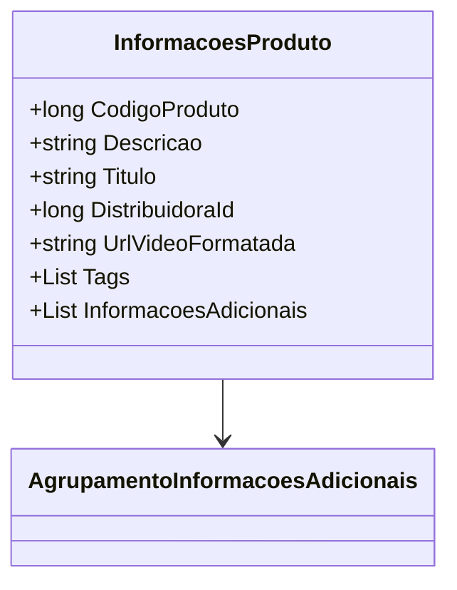

# InformacoesProduto
**Namespace**: IsthmusWinthor.Dominio.POCO.Produtos  
**Nome do Arquivo**: InformacoesProduto.cs  

## Visão Geral e Responsabilidade
A classe `InformacoesProduto` representa as informações detalhadas de um produto dentro do sistema. Ela agrupa dados críticos como código, descrição, título e informações adicionais que são essenciais para a identificação e apresentação dos produtos. Esta classe ajuda na organização e estruturação de dados de produtos, facilitando consultas e a manipulação de informações relacionadas no domínio de produtos.

## Métodos de Negócio
*Esta classe não possui métodos de negócio com lógica complexa, apenas propriedades simples.*

## Propriedades Calculadas e de Validação
- *Nenhuma propriedade calculada ou de validação foi identificada nesta classe.*

## Navigations Property
- `[AgrupamentoInformacoesAdicionais](AgrupamentoInformacoesAdicionais.md)`: Representa informações adicionais que podem ser agrupadas e fornecidas como parte das informações do produto.

## Tipos Auxiliares e Dependências
- Nenhum tipo auxiliar ou dependência externa foi identificado nesta classe.

## Diagrama de Relacionamentos

