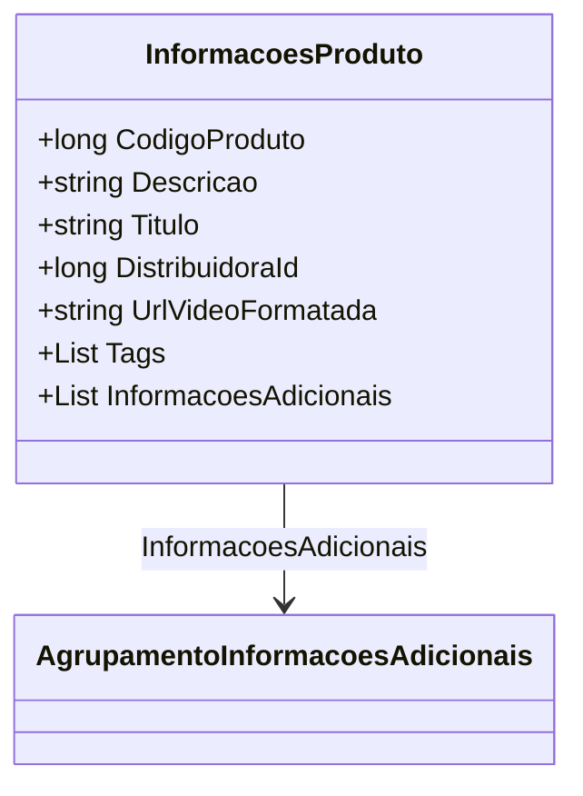

# InformacoesProduto
**Namespace**: IsthmusWinthor.Dominio.POCO.Produtos  
**Nome do Arquivo**: InformacoesProduto.cs  

### Visão Geral e Responsabilidade
A classe `InformacoesProduto` representa os detalhes de um produto dentro do sistema. Ela encapsula informações relevantes que ajudam na apresentação e gerenciamento de produtos, juntamente com suas informações adicionais, como tags e vídeo formatado. Este modelo é crucial para garantir que o usuário tenha acesso a todas as informações necessárias para a tomada de decisão sobre produtos.

### Métodos de Negócio
- **Título**: N/A (sem métodos de negócio com lógica complexa)
- **Objetivo**: N/A
- **Comportamento**: N/A
- **Retorno**: N/A

### Propriedades Calculadas e de Validação
- **Tags**: Esta propriedade pode conter uma lista de strings que representa as categorias ou características específicas do produto. A validação deve garantir que as tags não sejam nulas ou vazias.
  
### Navigations Property
- **AgrupamentoInformacoesAdicionais**: Esta propriedade representa uma lista de informações adicionais relacionadas ao produto.
  - [AgrupamentoInformacoesAdicionais](AgrupamentoInformacoesAdicionais.md)

### Tipos Auxiliares e Dependências
- N/A - Esta classe não depende de enumeradores ou classes auxiliares externas.

### Diagrama de Relacionamentos

---
Gerada em 29/12/2025 22:00:14
