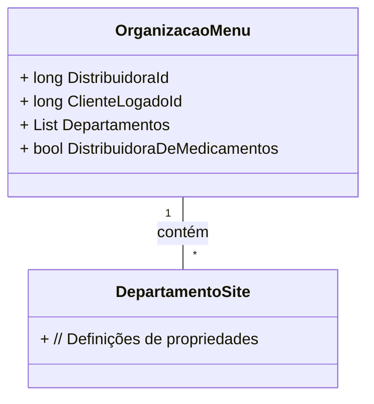

# OrganizacaoMenu
**Namespace**: IsthmusWinthor.Dominio.POCO.Produtos  
**Nome do Arquivo**: OrganizacaoMenu.cs  

## Visão Geral e Responsabilidade
A classe `OrganizacaoMenu` representa a estrutura de informações para organizar o menu de um sistema de distribuição de produtos. Ela desempenha um papel crítico em garantir que as informações da distribuidora e do cliente logado estejam disponíveis para a construção da interface de navegação do sistema. Isso permite que o sistema personalize a visualização e as opções de menu com base na distribuidora e tipo de cliente, assegurando uma experiência mais adequada e segmentada.

## Métodos de Negócio
Nenhum método com lógica de negócio foi identificado nesta classe.

## Propriedades Calculadas e de Validação
Nenhuma propriedade com lógica de cálculo ou validação foi identificada nesta classe.

## Navigations Property
- `Departamentos`: [DepartamentoSite](DepartamentoSite.md)

## Tipos Auxiliares e Dependências
Nenhum enumerador ou classe estática foi identificado como dependência nesta classe.  

## Diagrama de Relacionamentos

---
Gerada em 29/12/2025 22:00:23
