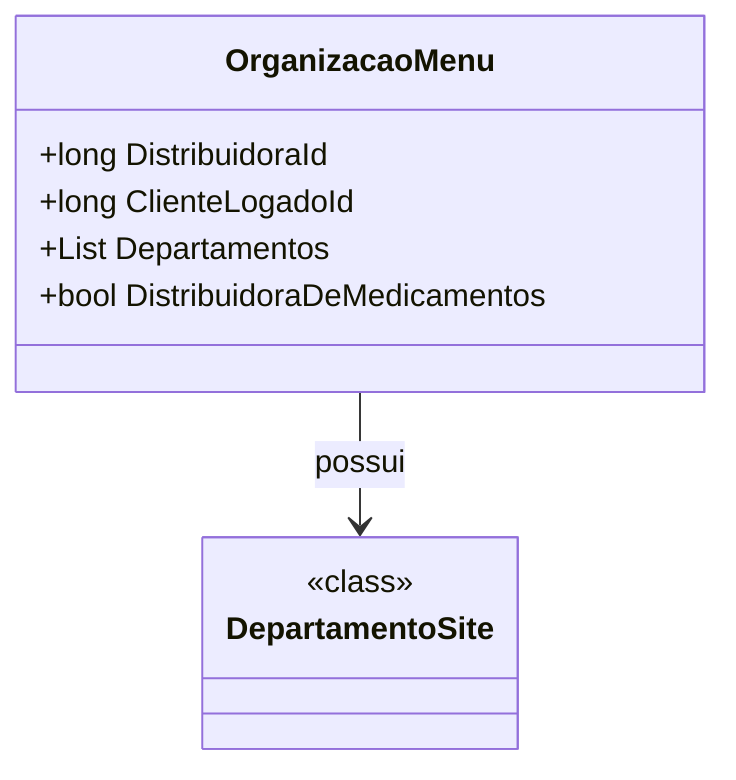

# OrganizacaoMenu

**Namespace**: IsthmusWinthor.Dominio.POCO.Produtos  
**Nome do Arquivo**: OrganizacaoMenu.cs  

## Visão Geral e Responsabilidade
A classe `OrganizacaoMenu` atua como um modelo para gerenciar as informações de menu relacionadas à organização de produtos em um sistema de distribuição. Ela é responsável por fornecer dados relevantes sobre a distribuidora associada e os departamentos que estão disponíveis para o cliente logado. Este modelo é fundamental para garantir que os usuários tenham acesso adequado às informações de produtos de acordo com sua organização e seu perfil.

## Métodos de Negócio
A classe `OrganizacaoMenu` é composta interamente por propriedades e não contém métodos de negócio com lógica implementada, portanto não há métodos a serem documentados nesta seção.

## Propriedades Calculadas e de Validação
A classe não possui propriedades que implementem lógica em seu `get` ou validação em seu `set`.

## Navigations Property
- `Departamentos`: lista de departamentos que são classes complexas do domínio. Presumindo que existe uma classe `DepartamentoSite`, o link para ela é: [DepartamentoSite](DepartamentoSite.md).

## Tipos Auxiliares e Dependências
Não existem enumeradores ou classes estáticas/helpers utilizadas diretamente na classe `OrganizacaoMenu`.

## Diagrama de Relacionamentos

