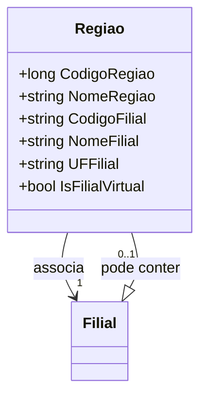

# Regiao
**Namespace**: IsthmusWinthor.Dominio.POCO  
**Nome do Arquivo**: Regiao.cs  

## Visão Geral e Responsabilidade
A classe `Regiao` atua como uma representação do conceito de região no sistema, conectando dados de regiões com informações relacionadas a filiais. Ela é responsável por garantir que as informações sobre as filiais estejam corretamente associadas a uma região, lidando com casos onde a filial padrão ou específica deve ser utilizada, dependendo do estado dos dados de entrada. Isso resolve o problema de consistência de dados entre regiões e suas filiais associadas.

## Métodos de Negócio

### Construtor: `Regiao(Dominio.Entidades.Regiao regiao, Entidades.Filial filialPadrao)`
- **Objetivo**: O construtor assegura que a classe `Regiao` é inicializada com dados válidos, determinando a filial correta a ser associada, seja ela a padrão ou a específica de acordo com as regras definidas no código.
- **Comportamento**: 
  1. Recebe uma instância de `Dominio.Entidades.Regiao` e uma instância opcional de `Entidades.Filial`.
  2. Verifica se o filial padrão é fornecida.
  3. Se sim, e a filial da região está vazia ou é igual a "99", associa os códigos, nome e propriedades da filial padrão.
  4. Caso contrário, associa as propriedades da filial específica da região.
- **Retorno**: Não há retorno, pois é um construtor.

### Override: `Equals(object obj)`
- **Objetivo**: Garante a comparação correta entre instâncias da classe `Regiao` com base nos códigos de região e filial.
- **Comportamento**: 
  1. Verifica se o objeto passado é uma instância de `Regiao`.
  2. Compara se `CodigoRegiao` e `CodigoFilial` são iguais.
- **Retorno**: Retorna um booleano que indica se as duas regiões são consideradas iguais.

### Override: `GetHashCode()`
- **Objetivo**: Fornece um código hash consistente para a instância da classe, garantindo a eficácia em coleções baseadas em hash.
- **Comportamento**: 
  1. Utiliza `HashCode.Combine()` para gerar um código hash com base em `CodigoRegiao` e `CodigoFilial`.
- **Retorno**: Retorna um código hash que representa a combinação dos dois valores.

## Propriedades Calculadas e de Validação
- **NomeFilial**: Atribui a propriedade `NomeFilial` dependendo se `NomeExibicao` da filial está vazio ou não. Isso garante que o nome mais informativo seja sempre utilizado.
- **IsFilialVirtual**: Essa propriedade é inicialmente definida com base se a filial associada é virtual, garantindo que o estado da filial seja corretamente refletido.

## Navigations Property
- [Filial](Filial.md) - Representa a filial associada à região, podendo ser uma filial padrão ou específica.

## Tipos Auxiliares e Dependências
- `Dominio.Entidades.Regiao` - Representa os dados de uma região.
- `Entidades.Filial` - Representa os dados de uma filial.

## Diagrama de Relacionamentos

---
Gerada em 29/12/2025 21:38:17
