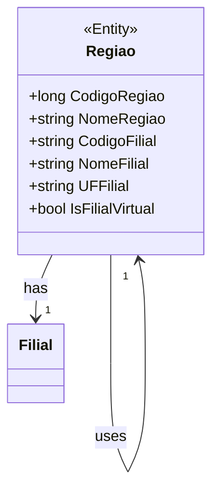

# Regiao

**Namespace**: IsthmusWinthor.Dominio.POCO  
**Nome do Arquivo**: Regiao.cs

## Visão Geral e Responsabilidade
A classe `Regiao` representa uma região dentro do domínio, encapsulando informações relevantes sobre a localidade e suas respectivas filiais. A principal responsabilidade desta classe é gerenciar a associação entre uma região e sua filial padrão, garantindo a integridade dos dados ao inicializar as propriedades adequadas conforme a lógica de negócios definida. O desafio que esta classe resolve é a necessidade de uma representação clara e consistente das relações entre regiões e suas filiais, assegurando que informações cruciais como códigos e nomes de filial sejam corretamente atribuídos.

## Métodos de Negócio

### Construtor: `Regiao(Dominio.Entidades.Regiao regiao, Entidades.Filial filialPadrao)`
- **Objetivo**: Garantir que os atributos da classe `Regiao` sejam populados corretamente, levando em conta as regras de atribuição para códigos e nomes de filial.
- **Comportamento**:
  1. O construtor recebe uma instância da classe `Regiao` e uma instância de `Filial`.
  2. Inicializa o `CodigoRegiao` e `NomeRegiao` com valores da instância `regiao`.
  3. Se a `filialPadrao` não for nula e a `regiao.Filial` estiver nula ou com código igual a "99", define as propriedades referente à filial como os dados da `filialPadrao`.
  4. Caso contrário, atribui as propriedades de filial diretamente da `regiao.Filial`.
  5. O nome da filial é determinado a partir do `NomeExibicao`, se disponível, caso contrário usa a unidade federativa (UF).
  
- **Retorno**: Esta operação não retorna um valor, mas inicializa adequadamente os atributos da classe.

### Método: `Equals(object obj)`
- **Objetivo**: Garantir que duas instâncias da classe `Regiao` são consideradas iguais se seus códigos de região e filial corresponderem.
- **Comportamento**:
  1. Verifica se o objeto passado é uma instância da classe `Regiao`.
  2. Compara os códigos de região e filial das duas instâncias.
  
- **Retorno**: Retorna `true` se as duas instâncias tiverem os mesmos códigos; caso contrário, retorna `false`.

### Método: `GetHashCode()`
- **Objetivo**: Garantir que o código hash da instância seja baseado em seus atributos principais, facilitando o uso da classe em coleções que requerem hashing.
- **Comportamento**:
  1. Combina os códigos de região e filial em um único valor hash.
  
- **Retorno**: Retorna o valor hash gerado a partir dos atributos.

## Propriedades Calculadas e de Validação

Não há propriedades na classe `Regiao` que contenham lógica no `get` ou validação no `set`. As propriedades são anêmicas, com exceção da lógica contida no construtor.

## Navigation Property

- `Dominio.Entidades.Regiao` - [Regiao](../Entidades/Regiao.md)  
- `Entidades.Filial` - [Filial](../Entidades/Filial.md)

## Tipos Auxiliares e Dependências

- `Entidades.Regiao` - [Regiao](../Entidades/Regiao.md)
- `Entidades.Filial` - [Filial](../Entidades/Filial.md)

## Diagrama de Relacionamentos

