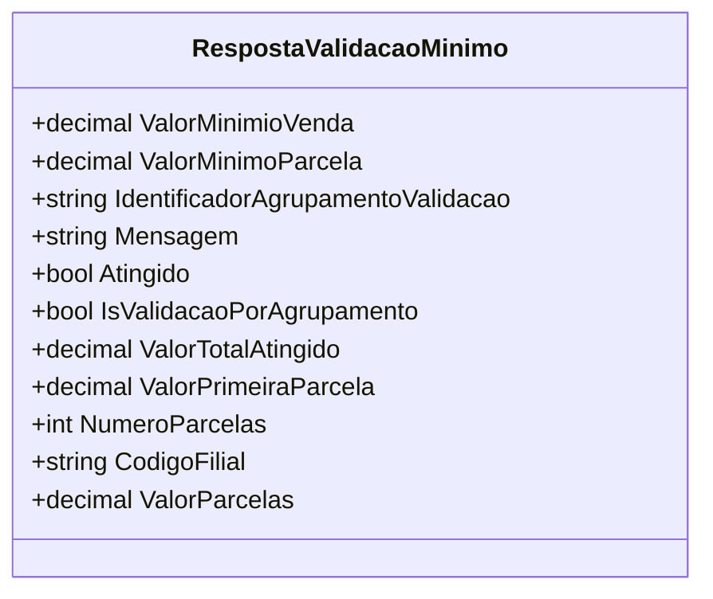

# RespostaValidacaoMinimo
**Namespace**: IsthmusWinthor.Dominio.POCO  
**Nome do Arquivo**: RespostaValidacaoMinimo.cs  

## Visão Geral e Responsabilidade
A classe `RespostaValidacaoMinimo` atua como um modelo de domínio responsável por encapsular os resultados de validações relacionadas a condições mínimas em transações financeiras, como vendas e parcelamentos. Ela resolve o problema de garantir que uma transação atenda aos requisitos mínimos de valores para ser considerada válida, permitindo o gerenciamento eficiente de mensagens e estados de validação para diferentes cenários financeiros.

## Propriedades Calculadas e de Validação
- **ValorParcelas**: 
  - **Regra**: Esta propriedade calcula o valor de cada parcela resultante da divisão do valor total atingido (`ValorTotalAtingido`) pelo número de parcelas (`NumeroParcelas`). Se não houver parcelas, o valor é ajustado para evitar divisão por zero, retornando o valor total como a única parcela.

## Navigations Property
- Não há propriedades que sejam classes complexas do domínio.

## Tipos Auxiliares e Dependências
- Nenhum enumerador ou classe auxiliar foi identificado como dependência nesta classe.

## Diagrama de Relacionamentos

---
Gerada em 29/12/2025 21:38:28
