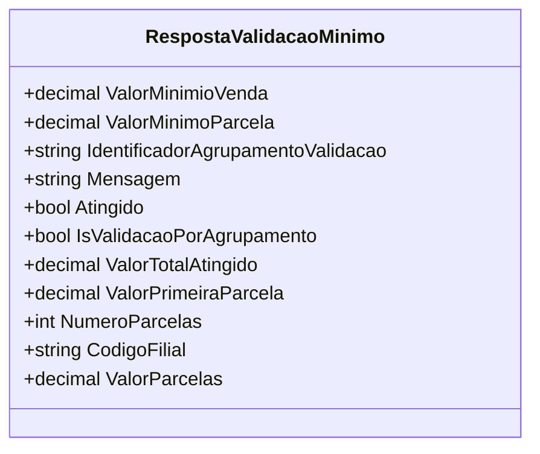

# RespostaValidacaoMinimo
**Namespace**: IsthmusWinthor.Dominio.POCO  
**Nome do Arquivo**: RespostaValidacaoMinimo.cs  

## Visão Geral e Responsabilidade
A classe `RespostaValidacaoMinimo` desempenha um papel crucial na validação de regras de negócio relacionadas a vendas e parcelas. Ela encapsula informações sobre a validação de valores mínimos que devem ser atendidos em um contexto de venda, oferecendo um retorno claro sobre se os critérios foram atingidos e fornecendo mensagens informativas ao usuário. Essa classe é fundamental para assegurar que as vendas e suas respectivas parcelas estejam em conformidade com as regras de negócio estabelecidas.

## Métodos de Negócio
### Título: `RespostaValidacaoMinimo(bool atingido, string mensagem)` - Construtor
- **Objetivo**: Este método construtor inicializa a instância da classe com a situação de validação (`atingido`) e uma mensagem explicativa, assegurando que a resposta de validação seja corretamente configurada ao ser instanciada.
- **Comportamento**: Ele atribui os valores passados (booleano e mensagem) às propriedades correspondentes da classe.
- **Retorno**: Não retorna valor, mas constrói um objeto `RespostaValidacaoMinimo` configurado adequadamente.

## Propriedades Calculadas e de Validação
### Propriedades Calculadas
- **ValorParcelas**: Esta propriedade calcula o valor de cada parcela com base no valor total atingido (`ValorTotalAtingido`) e no número de parcelas (`NumeroParcelas`). Se não houver parcelas (`NumeroParcelas` igual a 0), o valor da parcela é definido como o total atingido. Assim, a regra é garantir que mesmo na ausência de parcelamento, o total ainda possa ser representado.

## Navigations Property
- Não existem propriedades complexas do domínio nesta classe.

## Tipos Auxiliares e Dependências
- Esta classe não depende de nenhuma enumeração ou classes auxiliares que necessitem ser referenciadas.

## Diagrama de Relacionamentos

