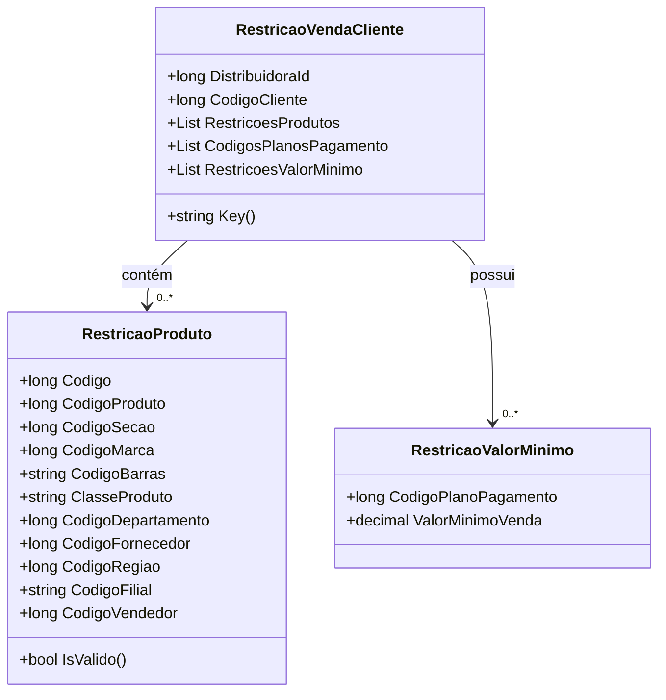

# RestricaoVendaCliente

- **Namespace**: IsthmusWinthor.Dominio.POCO
- **Nome do Arquivo**: RestricaoVendaCliente.cs

## Visão Geral e Responsabilidade
A classe `RestricaoVendaCliente` representa as restrições aplicáveis às vendas de um cliente específico em uma distribuidora. Ela armazena informações sobre restrições de produtos e valores mínimos de venda, garantindo que as transações comerciais sejam realizadas de acordo com as regras de negócios predefinidas. Assim, assegura que a empresa não participe de vendas que não atendem os critérios estabelecidos, minimizando riscos financeiros e promovendo a conformidade de vendas.

## Métodos de Negócio

### Título: Key() - Público
**Objetivo**: Garante uma chave única para armazenar em cache restrições de venda para um cliente específico.  
**Comportamento**: 
1. Recebe `DistribuidoraId` e `CodigoCliente` como parâmetros.
2. Gera uma chave no formato que possibilita o fácil acesso às restrições no armazenamento em cache Redis.

**Retorno**: Retorna uma string que representa a chave única para acessar as restrições de venda do cliente.

---

## Propriedades Calculadas e de Validação
- **`RestricoesProdutos`**: Possui lógica no método `IsValido()`, que valida as restrições de um produto.
  - **Regra**: Para que uma restrição de produto seja considerada válida, pelo menos um dos campos: `CodigoProduto`, `CodigoSeção`, `CodigoMarca`, `CodigoBarras`, `ClasseProduto`, `CodigoDepartamento`, `CodigoFornecedor`, `CodigoRegiao`, ou `CodigoFilial` deve ser preenchido.

## Navigations Property
- **`RestricoesProdutos`**: Uma lista de restrições de produtos vinculados à venda do cliente. 
  - [RestricaoProduto](RestricaoProduto.md)
  
- **`RestricoesValorMinimo`**: Uma lista de objetos que define os valores mínimos para os planos de pagamento utilizados pelo cliente.
  - [RestricaoValorMinimo](RestricaoValorMinimo.md)

## Tipos Auxiliares e Dependências
- [RestricaoProduto](RestricaoProduto.md)
- [RestricaoValorMinimo](RestricaoValorMinimo.md)

## Diagrama de Relacionamentos

