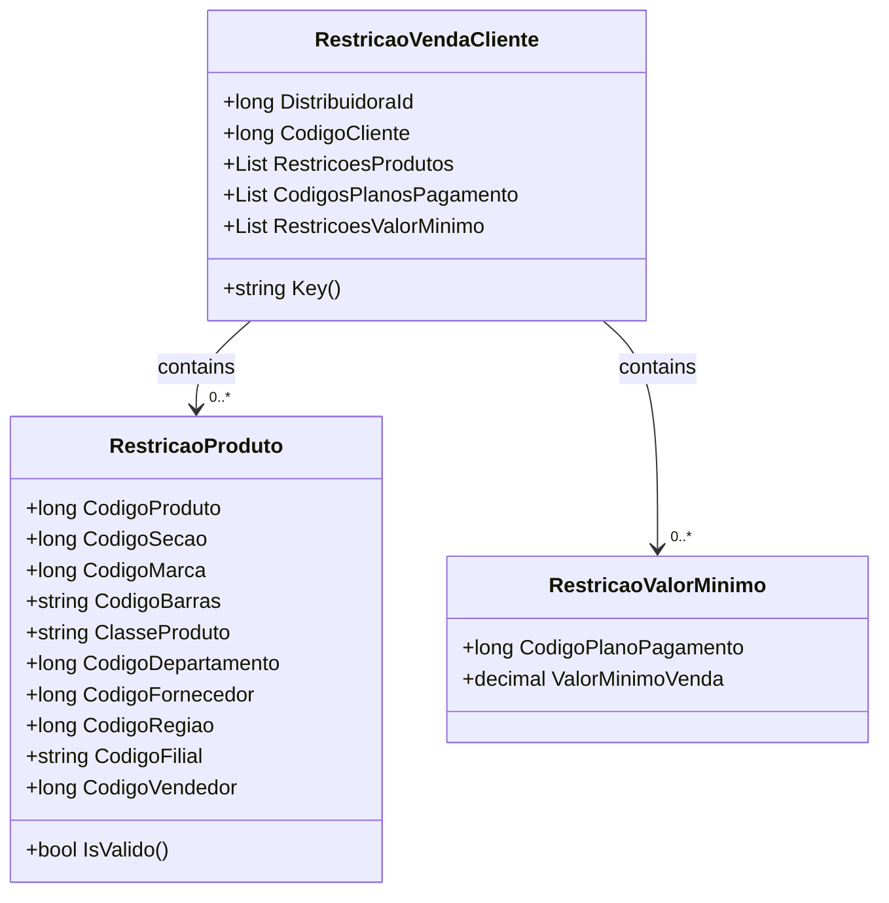

# RestricaoVendaCliente

**Namespace**: IsthmusWinthor.Dominio.POCO  
**Nome do Arquivo**: RestricaoVendaCliente.cs  

## Visão Geral e Responsabilidade
A classe `RestricaoVendaCliente` é responsável por gerenciar as restrições aplicáveis às vendas por cliente em uma distribuidora. Ela é fundamental para garantir que as vendas estejam em conformidade com políticas específicas, permitindo que o sistema controle quais produtos e condições de pagamento são válidos para cada cliente. Isso minimiza riscos financeiros e melhora a eficiência do processo de vendas.

## Métodos de Negócio

### Título: Key() – Public
- **Objetivo**: Gera uma chave única para armazenar e recuperar dados em cache relacionados a uma restrição de venda de um cliente.
- **Comportamento**: A chave é construída utilizando a `DistribuidoraId` e o `CodigoCliente`, permitindo a identificação rápida de informações em um sistema de cache.
- **Retorno**: Retorna uma string que serve como chave de cache específica para as restrições de venda deste cliente na distribuidora.

## Propriedades Calculadas e de Validação
- **RestricoesProdutos**: Esta lista contém objetos do tipo `RestricaoProduto`, que devem ser validados através do método `IsValido()`. Esse método garante que pelo menos uma propriedade de restrição relacionada ao produto esteja preenchida para considerar que a restrição é válida.

## Navigations Property
- [RestricaoProduto](RestricaoProduto.md)
- [RestricaoValorMinimo](RestricaoValorMinimo.md)

## Tipos Auxiliares e Dependências
- **Enumeradores**: Nenhum enumerador encontrado nesta classe.
- **Classes Estáticas/Helpers**: 
   - [RedisKeys](RedisKeys.md)
   
## Diagrama de Relacionamentos

---
Gerada em 29/12/2025 21:38:40
