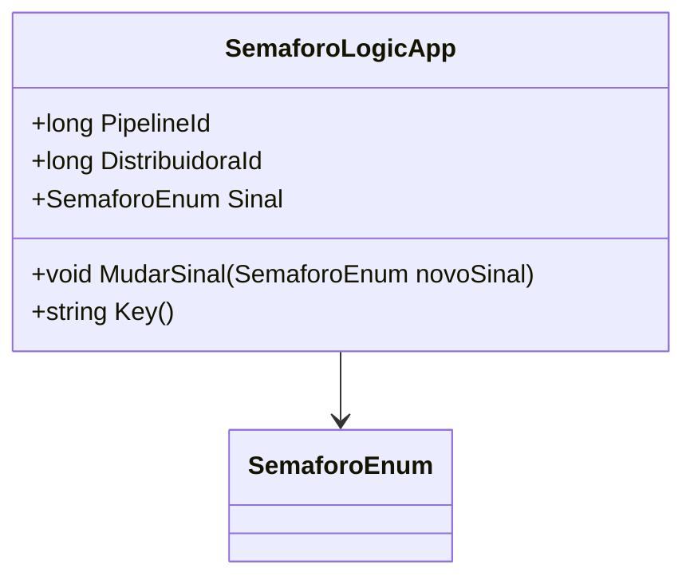

# SemaforoLogicApp
**Namespace**: IsthmusWinthor.Dominio.POCO  
**Nome do Arquivo**: SemaforoLogicApp.cs  

## Visão Geral e Responsabilidade
A classe `SemaforoLogicApp` representa a lógica de controle semafórico dentro de um pipeline de distribuição. Ela é responsável por gerenciar o estado do semáforo associado a uma distribuidora específica, garantindo que as mudanças no sinal sejam realizadas de forma controlada. O problema de negócio que esta classe resolve é o gerenciamento claro e eficiente do estado de sinalização em processos que dependem de distribuição, permitindo que diferentes partes do sistema sejam notificadas sobre o estado atual do semáforo.

## Métodos de Negócio

### Método: `MudarSinal(SemaforoEnum novoSinal)`
- **Objetivo**: Permitir a mudança do sinal do semáforo para um novo valor.
- **Comportamento**: 
  1. Recebe um novo sinal como parâmetro (do tipo `SemaforoEnum`).
  2. Atribui o novo sinal à propriedade `Sinal`, alterando efetivamente o estado do semáforo.
- **Retorno**: Este método não retorna valor. Ele atua diretamente no estado interno da instância.

### Método: `Key()`
- **Objetivo**: Gerar uma chave única de armazenamento em cache.
- **Comportamento**: 
  1. Utiliza os IDs do pipeline e da distribuidora para construir uma chave de cache.
  2. Invoca o método `RedisKeys.Semaforo` passando os IDs, que retorna uma string representando a chave.
- **Retorno**: Retorna uma string que representa a chave do semáforo no Redis para efeitos de cache.

## Propriedades Calculadas e de Validação
Não há propriedades com lógica de cálculo ou validação nesta classe, pois todos os atributos são definidos diretamente via construtor e não possuem lógica adicional em seus `get` ou `set`.

## Navigations Property
- N/A (não existem propriedades que apontam para outras classes complexas do domínio).

## Tipos Auxiliares e Dependências
- `[SemaforoEnum](SemaforoEnum.md)`: Enum que representa os estados possíveis do semáforo.

## Diagrama de Relacionamentos

