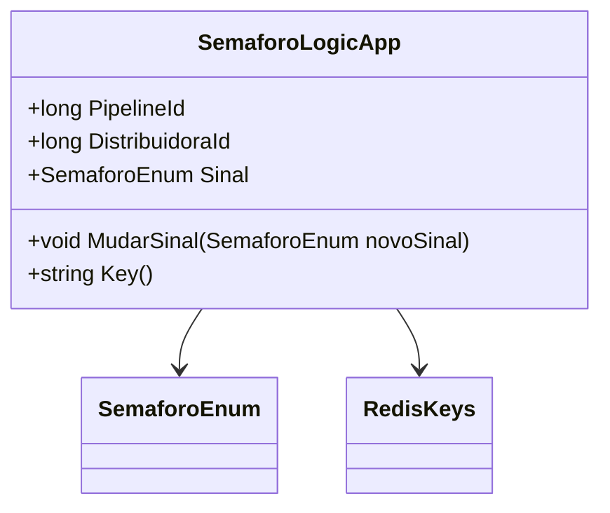

# SemaforoLogicApp
**Namespace**: IsthmusWinthor.Dominio.POCO  
**Nome do Arquivo**: SemaforoLogicApp.cs

## Visão Geral e Responsabilidade
A classe `SemaforoLogicApp` é responsável por gerenciar o estado do semáforo no contexto de um pipeline associado a uma distribuidora. A principal função desta classe é garantir que a transição entre diferentes sinais do semáforo (representados pelo enumerador `SemaforoEnum`) ocorra de forma controlada, fornecendo um meio para identificar e armazenar a chave de cache associada a essa instância. A classe atua como um motor de controle lógico que assegura que os estados do semáforo reflitam corretamente as regras de negócio operacionais do sistema, particularmente em relação a distribuidoras envolvidas em processos de pipeline.

## Métodos de Negócio
### Título: `MudarSinal` (public)
- **Objetivo**: Este método garante que o estado do sinal do semáforo possa ser alterado de uma maneira controlada.
- **Comportamento**: 
  1. Recebe um novo sinal do tipo `SemaforoEnum`.
  2. Atualiza a propriedade `Sinal` com o novo valor recebido.
- **Retorno**: Este método não retorna nenhum valor, efetivamente mudando o estado do semáforo para o valor especificado.

### Visualização
```mermaid
flowchart TD
    A[MudarSinal(novoSinal)] --> B{Verifica novoSinal}
    B -->|Sinal Válido| C[Atualiza Sinal]
    B -->|Sinal Inválido| D[Erro]
```

### Título: `Key` (public)
- **Objetivo**: Este método garante que uma chave única para a instância do semáforo seja gerada com base nos identificadores do pipeline e da distribuidora.
- **Comportamento**: 
  1. Utiliza os valores das propriedades `PipelineId` e `DistribuidoraId`.
  2. Chama o método estático `RedisKeys.Semaforo` com esses dois parâmetros para compor a chave de cache.
- **Retorno**: Retorna uma string que representa a chave única do semáforo no sistema de cache.

## Propriedades Calculadas e de Validação
- As propriedades `PipelineId`, `DistribuidoraId` e `Sinal` são definidas apenas no construtor e não possuem lógica de validação ou cálculo adicional nos métodos get/set, portanto não se aplicam a esta seção.

## Navigations Property
- Não existem propriedades que referenciam classes complexas do domínio.

## Tipos Auxiliares e Dependências
- Enum: [SemaforoEnum](SemaforoEnum.md)
- Classe estática: [RedisKeys](RedisKeys.md)

## Diagrama de Relacionamentos

---
Gerada em 29/12/2025 21:38:56
