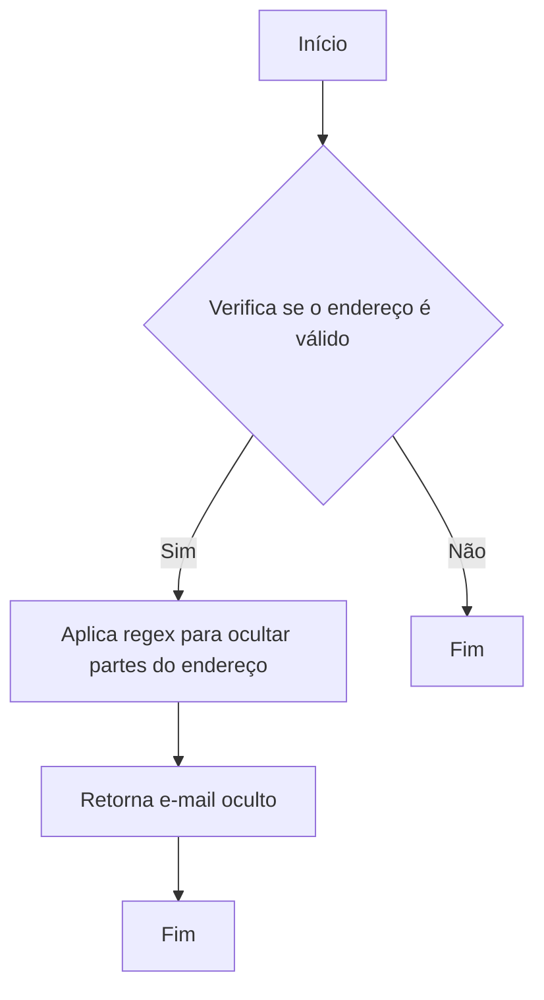
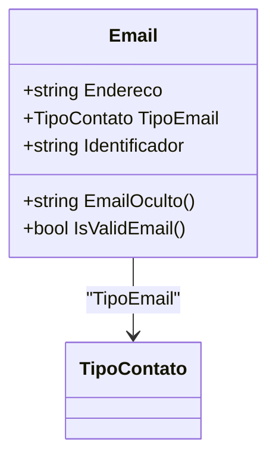

# Email
**Namespace**: IsthmusWinthor.Dominio.POCO.Shared  
**Nome do Arquivo**: Email.cs  

## Visão Geral e Responsabilidade
A classe `Email` representa um modelo de domínio rico para a manipulação de endereços de e-mail dentro do sistema. Ela encapsula não apenas o endereço de e-mail, mas também o tipo de contato e um identificador único. A classe é responsável por garantir a integridade dos dados relacionados a endereços de e-mail, incluindo a validação da formatação e a ocultação parcial do endereço.

## Métodos de Negócio

### EmailOculto
- **Título**: `EmailOculto` - Visibilidade: `public`
- **Objetivo**: Garante a privacidade do endereço de e-mail ao ocultar partes do mesmo para proteção de dados sensíveis.
- **Comportamento**: 
  1. Define um padrão regex para localizar partes do endereço de e-mail que devem ser ocultadas.
  2. Aplica a regex ao endereço, substituindo por asteriscos (`*`) os caracteres que devem ser ocultados, mantendo visíveis apenas o primeiro e o último caractere do nome do usuário.
- **Retorno**: Retorna uma string com o endereço de e-mail parcialmente oculto.

### IsValidEmail
- **Título**: `IsValidEmail` - Visibilidade: `public`
- **Objetivo**: Garante que o endereço de e-mail fornecido esteja em um formato válido.
- **Comportamento**: 
  1. Tenta criar uma instância de `MailAddress` usando o `Endereco` atual.
  2. Se a instância for criada com sucesso, o e-mail é considerado válido. Caso contrário, uma exceção de formato é capturada e a validade é negada.
- **Retorno**: Retorna um booleano indicando se o endereço de e-mail é válido (`true`) ou não (`false`).

## Propriedades Calculadas e de Validação
- **Endereco**: Contém o endereço de e-mail. A validade deste é garantida pelo método `IsValidEmail`.
- **TipoEmail**: Representa o tipo do contato e deve ser associado a um valor do enum `TipoContato`.

## Navigations Property
- **TipoContato**: Enum que categoriza o tipo de contato para o endereço de e-mail.  
   Link: `[TipoContato](TipoContato.md)`

## Tipos Auxiliares e Dependências
- **Enums**: 
  - `[TipoContato](TipoContato.md)`

## Diagrama de Relacionamentos

