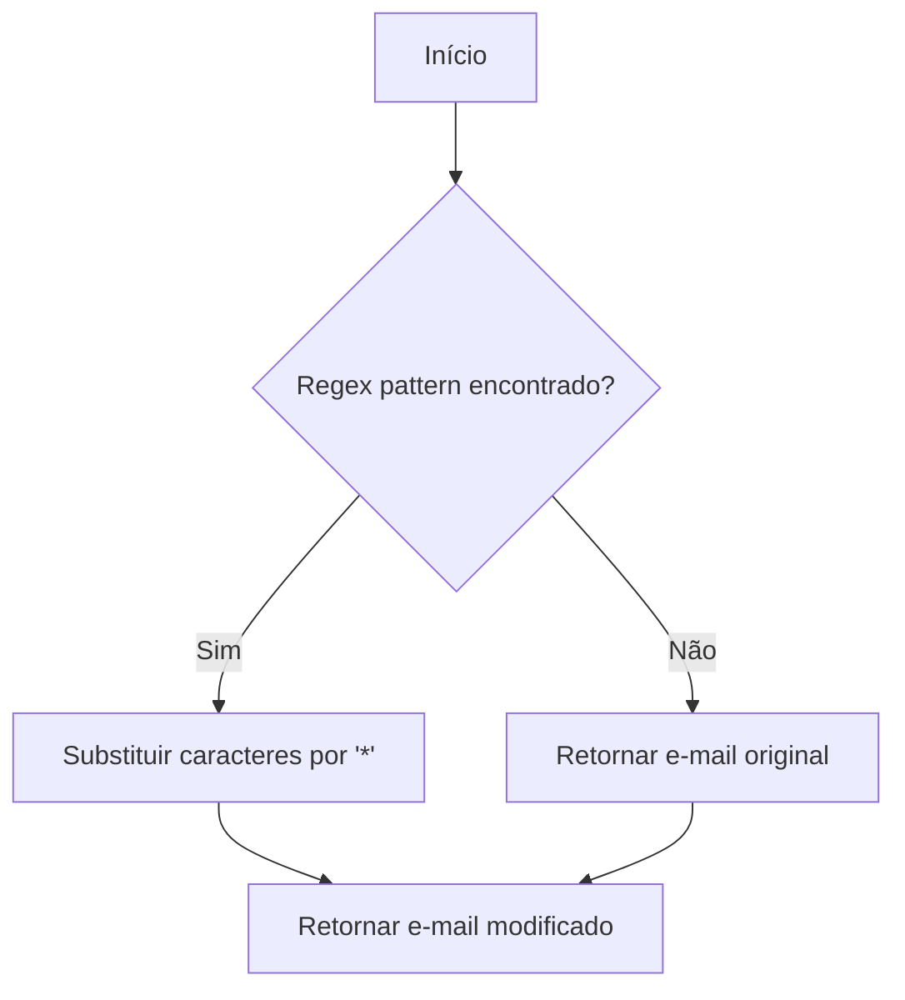
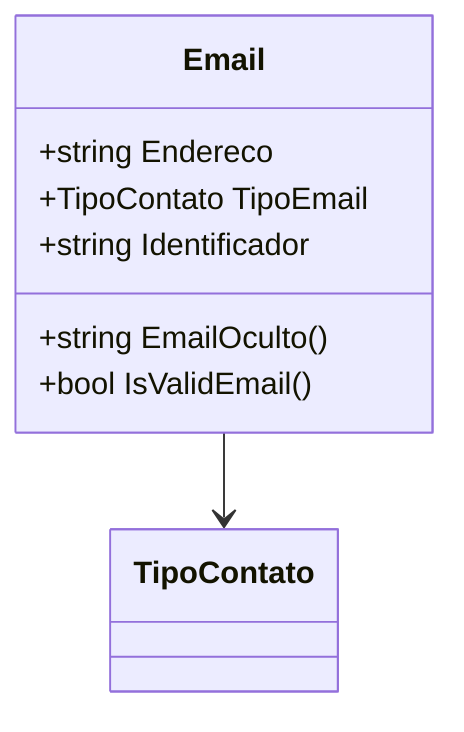

# Email
**Namespace**: IsthmusWinThor.Dominio.POCO.Shared  
**Nome do Arquivo**: Email.cs  

## Visão Geral e Responsabilidade
A classe `Email` representa um endereço de e-mail, incluindo informações sobre seu tipo de contato e a capacidade de validar sua formatação. Este modelo aborda a necessidade de manusear e garantir a integridade de dados de e-mail em um sistema, assegurando que os endereços sejam válidos e bem-estruturados, além de oferecer funcionalidades adicionais, como ocultar partes do e-mail para proteção da privacidade.

## Métodos de Negócio

### EmailOculto() - Público
- **Objetivo**: Garante que partes do endereço de e-mail sejam ocultadas para aumentar a privacidade do usuário.
- **Comportamento**: 
  1. Define um padrão de regex que identifica as partes do e-mail a serem ocultadas.
  2. Utiliza o método `Regex.Replace` para substituir os caracteres visíveis no meio do endereço por asteriscos, mantendo o primeiro e o último caractere visíveis.
  3. Retorna o e-mail modificado.
- **Retorno**: Retorna uma string que representa o endereço de e-mail com partes ocultas.

### IsValidEmail() - Público
- **Objetivo**: Assegura a validade do formato do endereço de e-mail.
- **Comportamento**: 
  1. Tenta criar uma instância de `MailAddress` com o endereço armazenado.
  2. Se bem-sucedida, retorna `true`, sinalizando que o e-mail tem um formato válido.
  3. Se ocorre uma exceção do tipo `FormatException`, retorna `false`, indicando um formato inválido.
- **Retorno**: Retorna um booleano, onde `true` representa um endereço válido e `false` representa um endereço inválido.

## Propriedades Calculadas e de Validação
- `Endereco`: Valida se o endereço de e-mail, quando criado, está em um formato correto por meio do método `IsValidEmail()`.
- `Identificador`: Gera um novo identificador único sempre que um novo objeto `Email` é instanciado, garantindo que cada e-mail seja singular.

## Navigations Property
- Nenhuma propriedade de classe complexa do domínio que seja um Navigation Property foi identificada nesta classe.

## Tipos Auxiliares e Dependências
- **Enumeradores**:
  - [TipoContato](TipoContato.md): Define os tipos de contatos que podem estar associados a um endereço de e-mail.

## Diagrama de Relacionamentos

---
Gerada em 29/12/2025 22:00:39
