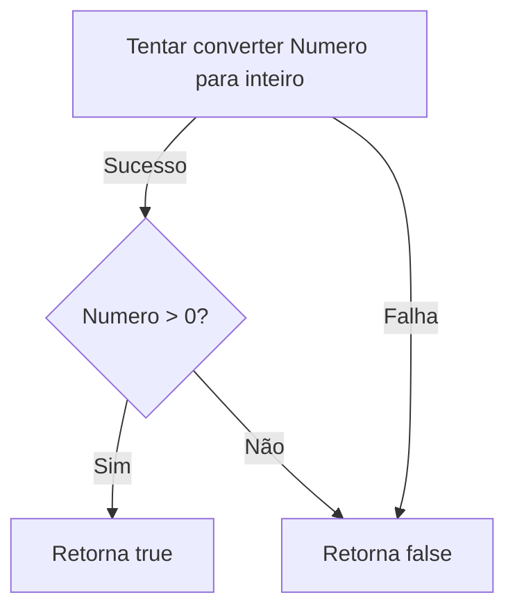
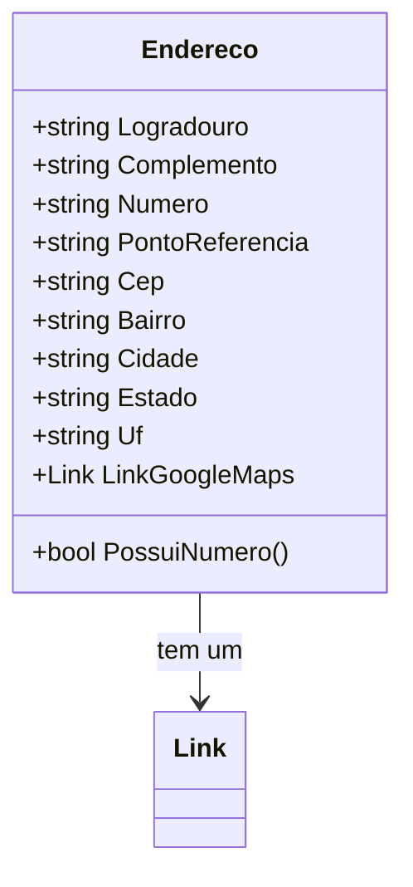

# Endereco
**Namespace**: IsthmusWinthor.Dominio.POCO.Shared  
**Nome do Arquivo**: Endereco.cs  

## Visão Geral e Responsabilidade
A classe `Endereco` representa um endereço físico, que inclui diversas propriedades como logradouro, número, complemento, ponto de referência, CEP, bairro, cidade, estado e a unidade federativa (UF). Essa classe é essencial para o armazenamento e manipulação de informações de endereço dentro do sistema, garantindo que os dados sejam estruturados e validados de forma correta. Ela ajuda a resolver o problema de identificação e localização de endereços, sendo fundamental para operações que dependem de informações de contato e entrega.

## Métodos de Negócio

### Título: `PossuiNumero` (public)
- **Objetivo**: Garante que o endereço contém um número válido, que deve ser um valor numérico maior que zero.
- **Comportamento**: 
  1. Tenta converter a propriedade `Numero` para um inteiro.
  2. Verifica se a conversão foi bem-sucedida e se o número é maior que zero.
  3. Retorna `true` se ambas as condições forem verdadeiras; caso contrário, retorna `false`.
- **Retorno**: `true` se o número do endereço é válido; `false` caso contrário.

## Propriedades Calculadas e de Validação
- **Logradouro**: endereços devem seguir regras de formatação específica e presença de caracteres não válidos deve ser validada.
- **Numero**: deve ser um valor que representa uma unidade, e é validado pelo método `PossuiNumero`.
- **Cep**: deve seguir o padrão brasileiro (XXXXX-XXX) e geralmente contém regras de validação específicas, que não estão representadas diretamente no código.

## Navigations Property
- **Link**: `[Link](Link.md)` - Representa um link para o Google Maps associado ao endereço, possibilitando a visualização do local.

## Tipos Auxiliares e Dependências
- **Link**: `[Link](Link.md)` - Representa um link ou referência a um recurso associado.

## Diagrama de Relacionamentos

