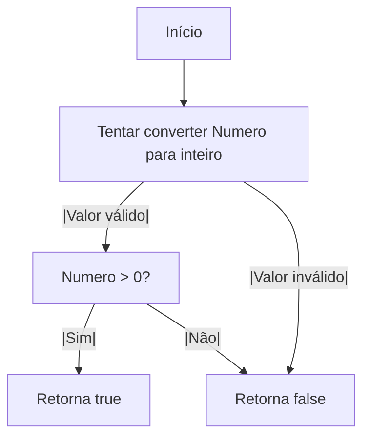
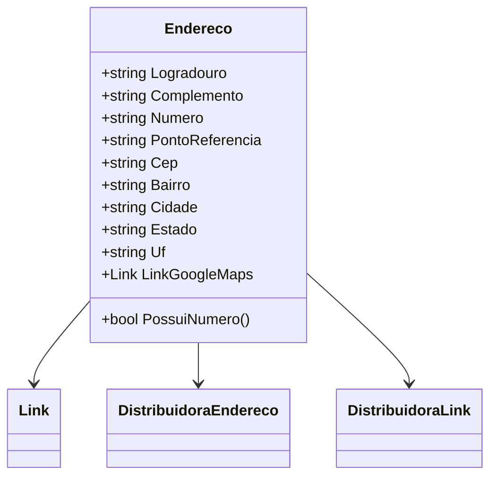

# Endereco
**Namespace**: IsthmusWinthor.Dominio.POCO.Shared  
**Nome do Arquivo**: Endereco.cs  

## Visão Geral e Responsabilidade
A classe `Endereco` representa uma entidade de domínio que encapsula a lógica e os dados relacionados a um endereço. Ela é responsável por gerenciar as informações de localização de forma consistente dentro do sistema, garantindo que dados como logradouro, número, CEP e outros sejam devidamente estruturados e validados. O objetivo principal da classe é assegurar que os endereços sejam representados de uma forma que facilite sua manipulação e comparação, especialmente em operações que exijam integridade e precisão.

## Métodos de Negócio

### Título: PossuiNumero() – Público
- **Objetivo**: Garante que o número do endereço seja um valor numérico válido e maior que zero.
- **Comportamento**:
  1. O método tenta converter a propriedade `Numero` em um inteiro.
  2. Se a conversão for bem-sucedida e o número for maior que zero, retorna `true`.
  3. Caso contrário, retorna `false`.
- **Retorno**: Retorna um valor booleano indicando se o número do endereço é válido.

## Propriedades Calculadas e de Validação
- **LinkGoogleMaps**: Comportamento via classe `Link` que pode definir um link para o Google Maps associado ao endereço. A validação é implicitamente gerida pela lógica da classe `Link`, que deve garantir que o link esteja no formato correto.

## Navigations Property
- **LinkGoogleMaps**: [Link](Link.md) - Representa um link para o Google Maps, ajudando na visualização da localização em um mapa.

## Tipos Auxiliares e Dependências
- **Link**: [Link](Link.md) - Classe utilizada para representar um link associado ao endereço.
- **DistribuidoraEndereco**: Utilizada no construtor para inicializar endereços a partir de dados de distribuidores.
- **DistribuidoraLink**: Utilizada para inicializar um link de Google Maps.

## Diagrama de Relacionamentos

Essa documentação apresenta uma visão clara e técnica da classe `Endereco`, abordando suas regras de negócio e associações, em conformidade com as diretrizes estabelecidas.
---
Gerada em 29/12/2025 22:00:55
