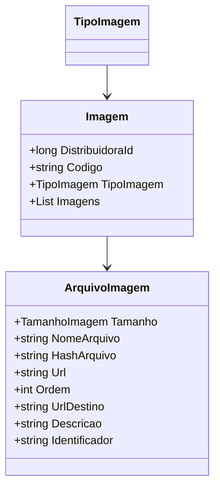
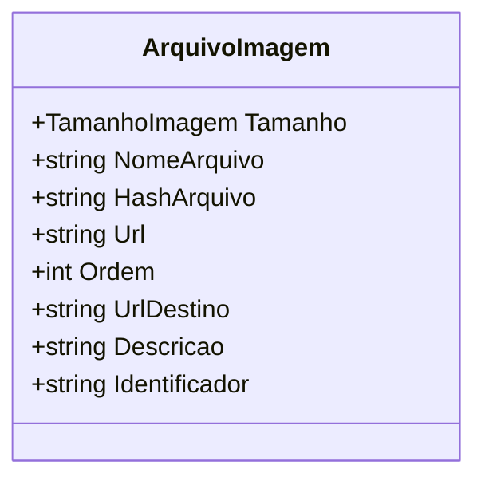

# Imagem

**Namespace**: IsthmusWinthor.Dominio.POCO.Shared  
**Nome do Arquivo**: Imagem.cs  

## Visão Geral e Responsabilidade
A classe `Imagem` representa um conjunto de imagens associadas a uma distribuidora no contexto do domínio. A responsabilidade principal dessa classe é manter a relação entre os diferentes tipos de imagens e seus arquivos específicos, facilitando a gestão e a organização visual de ativos digitais. Ela assegura que as imagens estejam corretamente agrupadas com suas propriedades definidoras, como o tipo de imagem e a ordem de apresentação.

## Métodos de Negócio
Não há métodos com lógica complexa na classe `Imagem`. Os métodos presentes são simples e focados em fornecer funcionalidades básicas de comparação de objetos.

## Propriedades Calculadas e de Validação
- **DistribuidoraId**: Representa a identificação única da distribuidora que possui as imagens. Esta propriedade é crucial para assegurar a integridade de dados, vinculando as imagens à sua respectiva distribuidora específica.
- **TipoImagem**: Tipo que define a categoria da imagem, assegurando que sejam utilizadas apenas as categorias permitidas pelo sistema.

## Navigation Property
- **Imagens**: Lista que contém os arquivos de imagem. Cada instância é da classe [ArquivoImagem](ArquivoImagem.md).

## Tipos Auxiliares e Dependências
- **TipoImagem**: [TipoImagem](TipoImagem.md)
- **ArquivoImagem**: [ArquivoImagem](ArquivoImagem.md)

## Diagrama de Relacionamentos

---

# ArquivoImagem

**Namespace**: IsthmusWinthor.Dominio.POCO.Shared  
**Nome do Arquivo**: ArquivoImagem.cs  

## Visão Geral e Responsabilidade
A classe `ArquivoImagem` é responsável por encapsular as propriedades que descrevem um arquivo de imagem individual, incluindo atributos que viabilizam a apresentação, organização e identificação de arquivos. Ela é essencial para a gestão das diversas versões e tamanhos de uma imagem, garantindo que cada arquivo possua informações que possibilitem sua utilização em diferentes contextos dentro do sistema.

## Métodos de Negócio
- **Título**: Equals (override)
  - **Objetivo**: Garantir a integridade da comparação entre objetos `ArquivoImagem`.
  - **Comportamento**: Compara o nome do arquivo atual com o nome de outro arquivo de imagem fornecido como parâmetro.
  - **Retorno**: Retorna `true` se os nomes dos arquivos forem iguais, indicando que se trata do mesmo arquivo de imagem.

- **Título**: GetHashCode (override)
  - **Objetivo**: Garantir um código hash único para facilitar o armazenamento e recuperação em estruturas que dependem de hash.
  - **Comportamento**: Gera um código hash com base no nome do arquivo, assegurando que arquivos com nomes diferentes resultarão em códigos hash distintos.
  - **Retorno**: Retorna um inteiro que representa o código hash do `NomeArquivo`.

## Propriedades Calculadas e de Validação
Nenhuma propriedade na classe `ArquivoImagem` possui lógica no `get` ou validação no `set`.

## Navigation Property
Nenhuma.

## Tipos Auxiliares e Dependências
- **TamanhoImagem**: [TamanhoImagem](TamanhoImagem.md)

## Diagrama de Relacionamentos

Esta documentação detalha as classes `Imagem` e `ArquivoImagem`, abordando suas responsabilidades dentro do sistema, reforçando a integridade de dados e organizando informações de maneira clara para futuras implementações e manutenções.
---
Gerada em 29/12/2025 22:01:18
