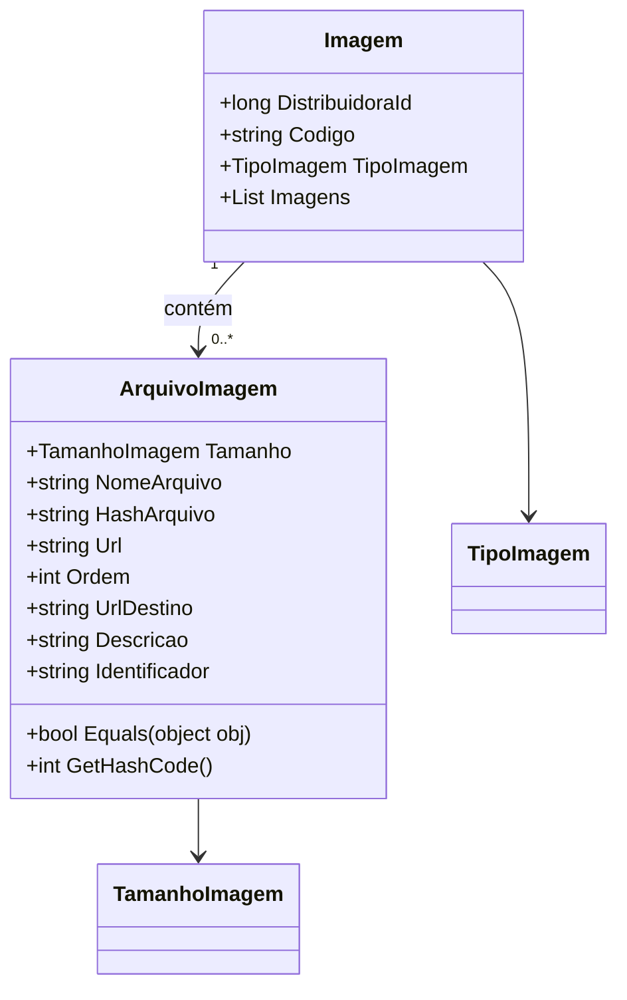

# Imagem

**Namespace**: IsthmusWinthor.Dominio.POCO.Shared  
**Nome do Arquivo**: Imagem.cs

## Visão Geral e Responsabilidade
A classe `Imagem` atua como um agregador de informações relacionadas a diferentes imagens de um recurso, permitindo a associação de múltiplos arquivos de imagem com propriedades específicas. Ela resolve o problema de organização e categorização de imagens, bem como o gerenciamento de seus metadados, como o tipo e a ordem, que são cruciais para a exibição consistente do conteúdo visual em um sistema corporativo.

## Métodos de Negócio
### `Equals() : public`
- **Objetivo**: Garante que duas instâncias de `ArquivoImagem` sejam comparadas com base no nome do arquivo, assegurando que o sistema possa identificar imagens duplicadas corretamente.
- **Comportamento**: 
  1. Verifica se o objeto passado é do tipo `ArquivoImagem`.
  2. Compara a propriedade `NomeArquivo` do objeto atual com a do objeto passado.
- **Retorno**: Retorna `true` se os nomes dos arquivos forem iguais, caso contrário, retorna `false`.

### `GetHashCode() : public`
- **Objetivo**: Garante a geração de um código hash único para a instância de `ArquivoImagem`, o que é fundamental para operações em coleções que exigem comparação e armazenamento eficientes, como dicionários ou conjuntos.
- **Comportamento**: 
  1. Utiliza `HashCode.Combine` para criar um valor hash baseado na propriedade `NomeArquivo`.
- **Retorno**: Retorna um valor inteiro que representa o hash do `NomeArquivo`.

## Propriedades Calculadas e de Validação
- **Tamanho**: Propriedade não tem lógica no getter, mas pode implicar em uma validação de tamanho conforme o contexto em que é utilizada.
- **Ordem**: Poderia ser utilizada para validar se a ordem dos arquivos é uma sequência numérica válida.

## Navigation Property
- **Imagens**: 
  - Listagem de arquivos de imagem. Cada item da lista é do tipo `[ArquivoImagem](ArquivoImagem.md)`.

## Tipos Auxiliares e Dependências
- Enumeração: 
  - `[TipoImagem](TipoImagem.md)`
  - `[TamanhoImagem](TamanhoImagem.md)`

## Diagrama de Relacionamentos

