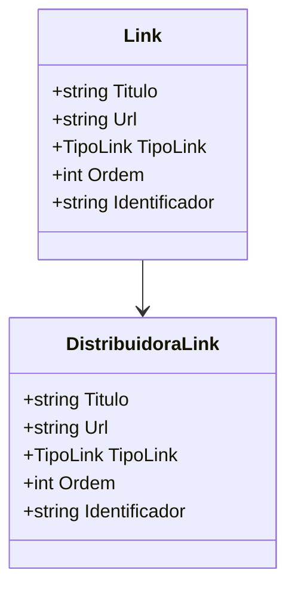

# Link
**Namespace**: IsthmusWinthor.Dominio.POCO.Shared  
**Nome do Arquivo**: Link.cs

## Visão Geral e Responsabilidade
A classe `Link` representa um link com atributos específicos como título, URL, tipo, ordem e um identificador único. Ela é utilizada para encapsular informações que podem ser usadas em navegação dentro do sistema, garantindo que cada link possua informações consistentes e um identificador único, que facilita o rastreamento e a gestão. Além disso, promove a reutilização de instâncias de link a partir de um objeto `DistribuidoraLink`.

## Métodos de Negócio

### Título: Equals (public)
**Objetivo**: Garante que dois objetos `Link` podem ser comparados para determinar se são iguais com base em suas propriedades significativas.

**Comportamento**:
1. Verifica se o objeto comparado é do tipo `Link`.
2. Compara as propriedades `Titulo`, `Url`, `TipoLink` e `Ordem`.
3. Retorna `true` se todas as propriedades forem iguais; caso contrário, retorna `false`.

**Retorno**: Retorna um valor booleano indicando se o objeto atual é igual ao objeto de referência.

### Título: GetHashCode (public)
**Objetivo**: Garante que um `Link` pode ser utilizado como chave em estruturas de dados baseadas em hash.

**Comportamento**:
1. Combina os valores de `Titulo`, `Url`, `TipoLink` e `Ordem` para produzir um código hash único.
   
**Retorno**: Retorna um código hash, que é um valor inteiro, representando o hash combinado das propriedades relevantes.

## Propriedades Calculadas e de Validação
Não há propriedades que apresentem lógica no `get` ou validação em `set`.

## Navigations Property
- `DistribuidoraLink` - Esta classe é um modelo de dados complexo e pode ser referenciada através do construtor que aceita um objeto `DistribuidoraLink`.

## Tipos Auxiliares e Dependências
- **Enumeradores**:
  - [TipoLink](TipoLink.md) - Representa os diferentes tipos de links que podem existir.

## Diagrama de Relacionamentos

---
Gerada em 29/12/2025 22:01:36
