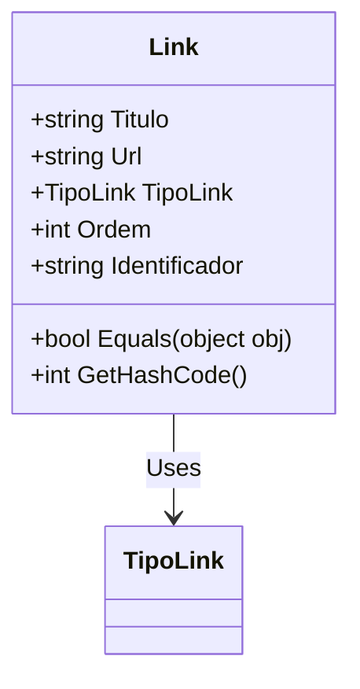

# Link
**Namespace**: IsthmusWinthor.Dominio.POCO.Shared  
**Nome do Arquivo**: Link.cs  

## Visão Geral e Responsabilidade
A classe `Link` representa uma entidade de domínio que encapsula a definição de um link, incluindo suas propriedades como título, URL, tipo e ordem. Essa classe é fundamental para a construção de uma estrutura que permite a apresentação e organização de links de forma sistemática, especialmente em contextos onde relacionamentos entre diferentes componentes devem ser geridos de forma eficaz. A classe resolve o problema de negócio de gerenciar informações sobre links, proporcionando uma forma organizada e encapsulada para trabalhar com esses dados.

## Métodos de Negócio

### Título: `Equals` (public override)
- **Objetivo**: Garante a comparação correta entre duas instâncias de `Link`, permitindo verificar a equivalência com base em suas propriedades principais.
- **Comportamento**: 
    1. O método verifica se o objeto passado é do tipo `Link`.
    2. Se for, compara as propriedades `Titulo`, `Url`, `TipoLink` e `Ordem` para determinar se dois links são considerados iguais.
- **Retorno**: Retorna `true` se todos os componentes comparados forem iguais; caso contrário, retorna `false`.

### Título: `GetHashCode` (public override)
- **Objetivo**: Fornece um código hash consistente para a instância da classe `Link`, o que é crucial para o uso em coleções que utilizam hash, como `Dictionary` ou `HashSet`.
- **Comportamento**:
    1. O método combina as propriedades `Titulo`, `Url`, `TipoLink` e `Ordem` usando `HashCode.Combine`, gerando um inteiro representativo da instância.
- **Retorno**: Retorna um valor inteiro que representa o código hash da instância.

## Propriedades Calculadas e de Validação
- Não há propriedades com lógica de cálculo ou validação na classe `Link`. Todas as propriedades são simples e seu valor é diretamente atribuído.

## Navigations Property
- Não existem propriedades de navegação complexas definidas na classe `Link`.

## Tipos Auxiliares e Dependências
- **Enumeradores**: 
  - `[TipoLink](TipoLink.md)`: Enum que determina o tipo do link.
- **Classes Estáticas/Helpers**: Nenhuma classe auxiliar ou helper é utilizada.

## Diagrama de Relacionamentos

