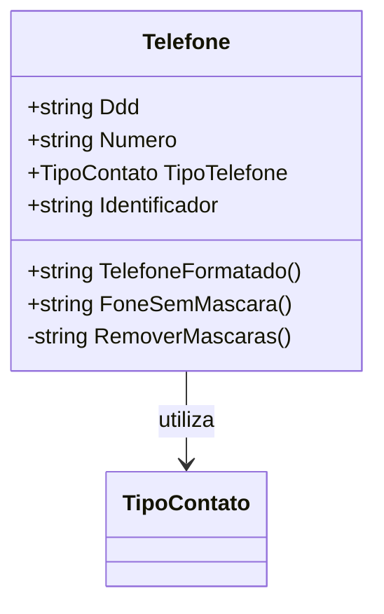

# Telefone
**Namespace**: IsthmusWinthor.Dominio.POCO.Shared  
**Nome do Arquivo**: Telefone.cs  

## Visão Geral e Responsabilidade
A classe `Telefone` é um modelo de domínio que representa um número de telefone, incluindo suas propriedades associadas, como DDD (código de área) e tipo de contato. Ela encapsula a lógica para manipulação e formatação de números de telefone, garantindo que as várias representações de um número sejam tratadas de maneira consistente. A classe é importante para a validação e formatação de dados de contato em um sistema corporativo, contribuindo para a integridade dos dados.

## Métodos de Negócio

### TelefoneFormatado() - Público
- **Objetivo**: Garante que o número de telefone esteja formatado corretamente de acordo com seu tipo e estrutura.
- **Comportamento**: 
  1. Verifica se o número começa com "0800" ou "0900". Se sim, retorna o número sem formatação.
  2. Chama o método `RemoverMascaras()` para obter o número sem caracteres especiais.
  3. Formata o número de telefone com base na sua quantidade de dígitos:
     - Para um número fixo de 8 dígitos, insere um hífen após o quarto dígito.
     - Para um número celular de 9 dígitos, insere um hífen após o quinto dígito.
  4. Se o DDD não estiver presente, retorna o telefone formatado apenas.
  5. Se o DDD estiver presente, retorna o telefone no formato "(DDD) telefone".
- **Retorno**: Uma string representando o número de telefone formatado.

```mermaid
flowchart TD
    A[Início] --> B{Número começa com 0800 ou 0900?}
    B -- Sim --> C[Retornar Número]
    B -- Não --> D[Remover Máscaras]
    D --> E{Telefone sem máscara possui 8 ou 9 dígitos?}
    E -- 8 dígitos --> F[Inserir hífen após 4º dígito]
    E -- 9 dígitos --> G[Inserir hífen após 5º dígito]
    F --> H{DDD está presente?}
    G --> H
    H -- Sim --> I[Retornar "(DDD) telefone"]
    H -- Não --> J[Retornar telefone]
```

### FoneSemMascara() - Público
- **Objetivo**: Remove a máscara do número de telefone e DDD, unindo ambos em uma única representação simples.
- **Comportamento**: 
  1. Chama o método `RemoverMascaras()` para obter DDD e telefone sem caracteres especiais.
  2. Concatena o DDD e o telefone sem máscara e os retorna.
- **Retorno**: Uma string contendo o DDD seguido pelo número do telefone, sem formatação.

## Propriedades Calculadas e de Validação
- Não há propriedades com lógica nas operações de `get` ou `set` que exijam validação ou faça cálculos.

## Navigation Property
- Não existem propriedades de navegação que sejam classes complexas do domínio nesta classe.

## Tipos Auxiliares e Dependências
- **Enumeradores**:
  - [TipoContato](TipoContato.md) - Enum que define os tipos de contato relacionados ao telefone.

## Diagrama de Relacionamentos

---
Gerada em 29/12/2025 22:01:59
