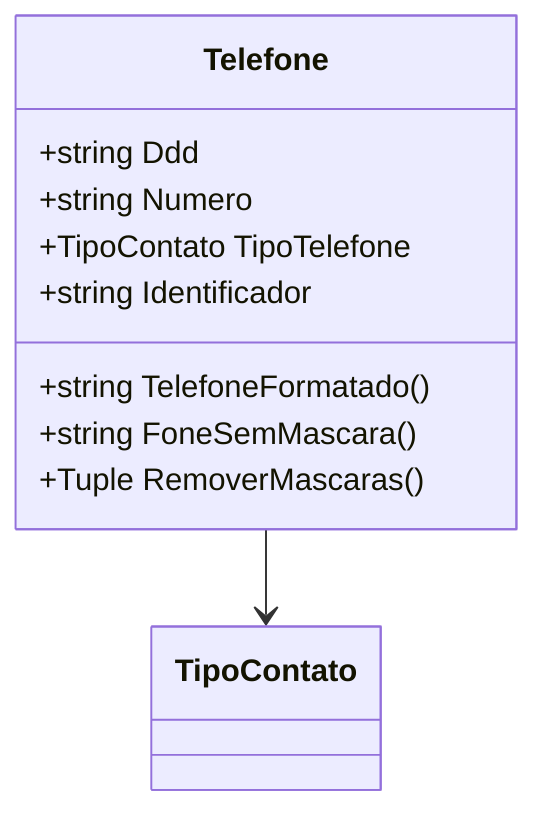

# Telefone
**Namespace**: IsthmusWinthor.Dominio.POCO.Shared  
**Nome do Arquivo**: Telefone.cs  

## Visão Geral e Responsabilidade
A classe `Telefone` é um Rich Domain Model que representa um número de telefone, incluindo seu formato, tipo e DDD (código de área). Ela desempenha um papel fundamental na validação e formatação de números de telefone, assegurando que o dado esteja em conformidade com as regras de negócios pertinentes a números de contato em um sistema corporativo.

## Métodos de Negócio

### TelefoneFormatado()
- **Objetivo**: Garante que o número de telefone seja retornado em um formato legível e consistente, respeitando as especificidades de telefones fixos e celulares além de lidar com números toll-free.
- **Comportamento**: 
  1. Verifica se o `Numero` inicia com "0800" ou "0900" e, se sim, retorna o número sem formatação.
  2. Chama o método `RemoverMascaras` para eliminar caracteres não numéricos do número.
  3. Avalia o comprimento do número sem máscara:
     - Para números de 8 dígitos, insere um hífen na posição correta.
     - Para números de 9 dígitos, também insere um hífen na posição correta.
  4. Verifica se o `Ddd` está vazio:
     - Se sim, retorna somente o telefone formatado.
     - Se não, retorna o DDD seguido do telefone formatado.
- **Retorno**: Um `string` representando o número de telefone formatado, que inclui DDD se disponível e a formatação apropriada.

```mermaid
flowchart TD
    A[Início] --> B{Número inicia com 0800 ou 0900?}
    B -- Sim --> C[Retorna número sem formatação]
    B -- Não --> D[Chama RemoverMascaras()]
    D --> E{Número sem máscara possui 8 ou 9 dígitos?}
    E -- 8 dígitos --> F[Insere '-' na posição correta para telefone fixo]
    E -- 9 dígitos --> G[Insere '-' na posição correta para telefone celular]
    F --> H{DDD está vazio?}
    G --> H
    H -- Sim --> I[Retorna telefone formatado]
    H -- Não --> J[Retorna DDD e telefone formatado]
    I --> K[Fim]
    J --> K
```

### FoneSemMascara()
- **Objetivo**: Fornece o número de telefone e DDD concatenados sem qualquer formatação.
- **Comportamento**:
  1. Chama o método `RemoverMascaras` para eliminar caracteres não numéricos do DDD e do número.
  2. Concatena o DDD e o telefone sem máscara.
- **Retorno**: Um `string` contendo o DDD e o número de telefone como um único texto contínuo.

### RemoverMascaras()
- **Objetivo**: Remove caracteres não numéricos dos campos DDD e número de telefone, padronizando as informações para fins de análise.
- **Comportamento**:
  1. Filtra o `Numero` e `Ddd`, mantendo apenas dígitos.
  2. Se houver um número de telefone com 10 ou 11 dígitos e sem DDD, extrai o DDD dos dois primeiros dígitos.
- **Retorno**: Uma tupla contendo o DDD e o telefone sem máscara.

## Propriedades Calculadas e de Validação
- **Identificador**: Este campo é gerado automaticamente como um novo GUID quando um objeto Telefone é instanciado com um número.
- **TipoTelefone**: A propriedade deve ser validada para assegurar que o tipo de contato atribuído é compatível com as regras de negócios da aplicação. Não há lógica direta visível nas validações do set, mas deve ser considerada no uso do sistema.

## Navigations Property
- Esta classe não possui diretamente propriedades de navegação complexas para outras entidades do domínio, mas dependendo do contexto, pode estar ligada a outras entidades de contato.

## Tipos Auxiliares e Dependências
- **Enumeradores**:
  - `[TipoContato](TipoContato.md)`: Representa os tipos de contato que podem ser associados a um telefone.

## Diagrama de Relacionamentos

