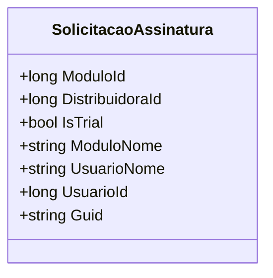

# SolicitacaoAssinatura
**Namespace**: IsthmusWinthor.Dominio.POCO  
**Nome do Arquivo**: SolicitacaoAssinatura.cs  

## Visão Geral e Responsabilidade
A classe `SolicitacaoAssinatura` representa um modelo de domínio que encapsula os detalhes de uma solicitação de assinatura dentro do contexto de um sistema de distribuição. Sua principal responsabilidade é armazenar informações relevantes sobre o módulo solicitado, a distribuidora envolvida, informações do usuário e o status da assinatura (se é uma versão de avaliação ou não). Isso permite que o sistema gerencie e processe solicitações de assinatura de maneira lógica e organizada, garantindo integridade nas operações de assinatura.

## Métodos de Negócio
Não há métodos com lógica complexa definidos nesta classe, apenas propriedades para transporte de dados.

## Propriedades Calculadas e de Validação
Não existem propriedades com lógica no `get` ou validação no `set` nesta classe.

## Navigation Property
- Não existem propriedades que sejam classes complexas do domínio nesta classe.

## Tipos Auxiliares e Dependências
- Nenhum enumerador (Enums) ou classes estáticas/helpers são utilizadas nesta classe.

## Diagrama de Relacionamentos

