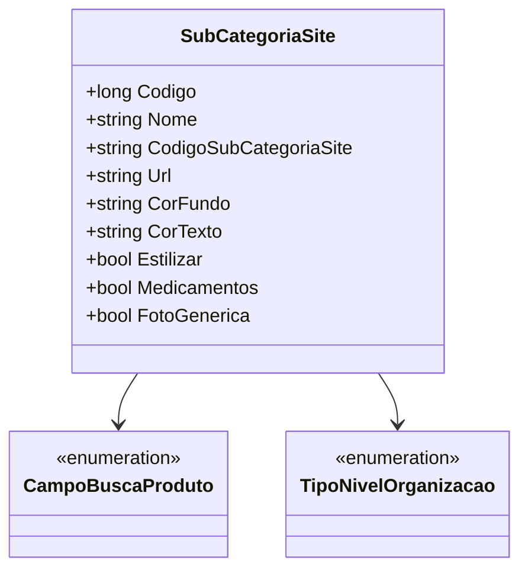

# SubCategoriaSite
**Namespace**: IsthmusWinthor.Dominio.POCO  
**Nome do Arquivo**: SubCategoriaSite.cs  

### Descrição
A classe `SubCategoriaSite` é responsável pelo transporte de dados relacionados a subcategorias dentro de um site, incluindo propriedades como nome, código, e atributos visuais que determinam a forma como a subcategoria é apresentada ao usuário.

### Propriedades
As seguintes propriedades têm regras que determinam seu comportamento ou sua apresentação:

- `CampoBuscaProduto`: Tipo de busca que pode ser aplicada aos produtos da subcategoria, referenciando a classe [CampoBuscaProduto](CampoBuscaProduto.md).
- `TipoNivelOrganizacao`: Classificação da subcategoria dentro de uma estrutura hierárquica, referenciando a enumeração [TipoNivelOrganizacao](TipoNivelOrganizacao.md).

### Tipos Auxiliares e Dependências
- `CampoBuscaProduto`: [CampoBuscaProduto](CampoBuscaProduto.md)
- `TipoNivelOrganizacao`: [TipoNivelOrganizacao](TipoNivelOrganizacao.md)

### Diagrama de Relacionamentos

---
Gerada em 29/12/2025 21:39:11
