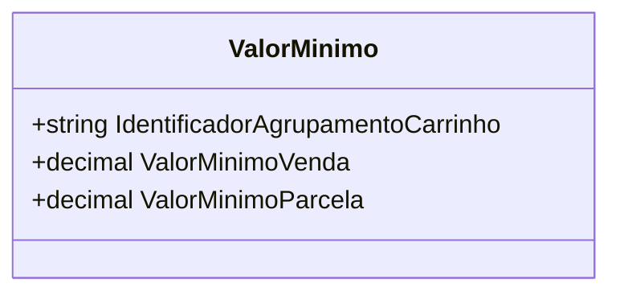

# ValorMinimo
**Namespace**: IsthmusWinthor.Dominio.POCO  
**Nome do Arquivo**: ValorMinimo.cs  

## Visão Geral e Responsabilidade
A classe `ValorMinimo` atua como um representante do conceito de valor mínimo associado a um agrupamento de carrinho de vendas. Ela é responsável por manter as informações relativas ao valor mínimo de venda e ao valor mínimo de parcela que devem ser obedecidos em transações associadas a um grupo específico. Isso garante consistência e integridade nas operações comerciais, assegurando que não haja vendas abaixo desses valores estabelecidos, o que poderia comprometer a rentabilidade.

## Métodos de Negócio
Não há métodos que contêm lógica de negócio significante ou complexidade em sua implementação na classe `ValorMinimo`. A classe é composta basicamente por propriedades anêmicas.

## Propriedades Calculadas e de Validação
Não há propriedades com lógica de validação ou cálculos complexos no `get` ou no `set`. As propriedades são diretamente manipuláveis em sua forma básica.

## Navigations Property
Não há propriedades que correspondam a classes complexas do domínio nesta classe específica.

## Tipos Auxiliares e Dependências
Não há enumeradores ou classes estáticas/helpers que a classe `ValorMinimo` utiliza.

## Diagrama de Relacionamentos

Esta documentação refere-se à classe `ValorMinimo`, que serve exclusivamente para fins de transporte de dados relativos a valores mínimos em um contexto de vendas.
---
Gerada em 29/12/2025 21:39:19
