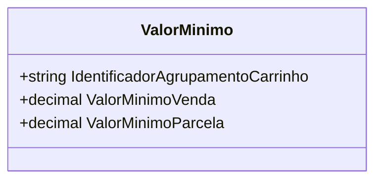

# ValorMinimo
**Namespace**: IsthmusWinthor.Dominio.POCO  
**Nome do Arquivo**: ValorMinimo.cs

## Visão Geral e Responsabilidade
A classe `ValorMinimo` é responsável por encapsular os valores mínimos necessários para a venda e parcelamento de operações de um carrinho de compras. Ela aborda a necessidade de estabelecer limites financeiros para transações, garantindo que cada transação respeite as condições mínimas necessárias para sua execução, como o valor total de uma venda ou o valor de cada parcela. 

## Métodos de Negócio
A classe `ValorMinimo` não possui métodos de negócio com lógica complexa além dos construtores. Ela se limita a definir e armazenar valores mínimos.

## Propriedades Calculadas e de Validação
As propriedades `ValorMinimoVenda` e `ValorMinimoParcela` são utilizadas para assegurar que as transações não sejam realizadas abaixo dos limites financeiros definidos.

## Navigation Properties
Esta classe não contém Navigation Properties com outras classes complexas do domínio.

## Tipos Auxiliares e Dependências
Esta classe não depende de enumeradores ou classes auxiliares externas.

## Diagrama de Relacionamentos

