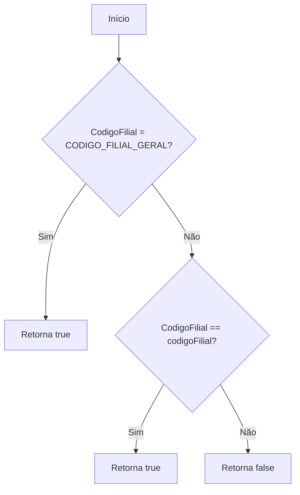
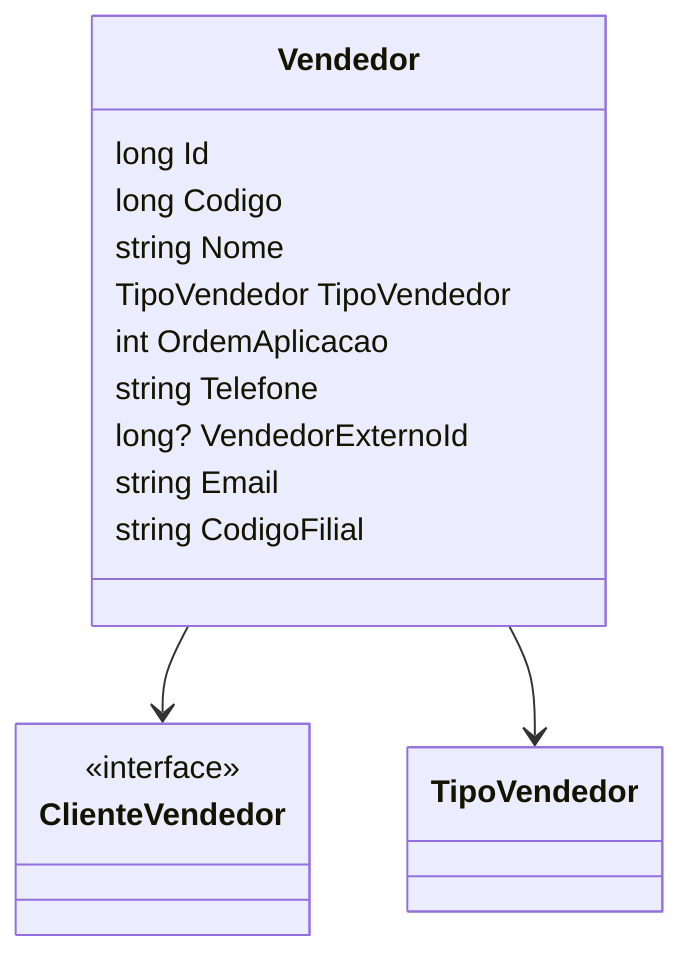

# Vendedor
**Namespace**: IsthmusWinthor.Dominio.POCO  
**Nome do Arquivo**: Vendedor.cs  

## Visão Geral e Responsabilidade
A classe `Vendedor` representa um vendedor dentro do sistema, encapsulando informações relevantes como código, nome, tipo de vendedor e dados de contato. Ela resolve a necessidade de organizar e manipular dados de vendedores em um contexto de aplicação comercial, permitindo assim o gerenciamento eficaz das vendas e a associação com clientes.

## Métodos de Negócio

### Título: AtendeFilial (public)
- **Objetivo**: Garante que o vendedor possa ser verificado quanto à sua capacidade de atender a uma filial específica.
- **Comportamento**:
  1. O método verifica se o `CodigoFilial` do vendedor é igual ao `CODIGO_FILIAL_GERAL`.
  2. Se for verdadeiro, retorna `true`, indicando que o vendedor atende a todas as filiais.
  3. Caso contrário, compara o `CodigoFilial` do vendedor com o código da filial fornecida como parâmetro.
  4. Retorna `true` se o vendedor atende à filial específica; caso contrário, retorna `false`.
- **Retorno**: Um valor booleano indicando se o vendedor tem permissão para atender à filial fornecida.

## Propriedades Calculadas e de Validação

### Propriedade: `CodigoFilial`
- **Regra**: Se a propriedade `_codigoFilial` estiver vazia ou nula, deve retornar um código padrão (CODIGO_FILIAL_GERAL). Se um valor válido for atribuído ao `set`, ele deve substituir o código padrão.

## Navigations Property
- [ClienteVendedor](ClienteVendedor.md): Classe associada que define a relação entre um vendedor e um cliente.

## Tipos Auxiliares e Dependências
- [TipoVendedor](TipoVendedor.md): Enumerador que categoriza o tipo de vendedor.

## Diagrama de Relacionamentos

---
Gerada em 29/12/2025 21:39:31
