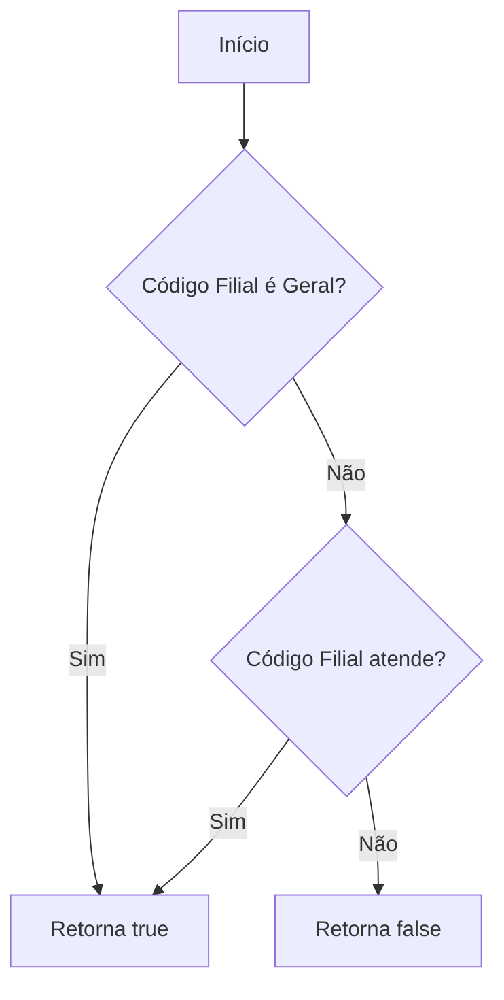
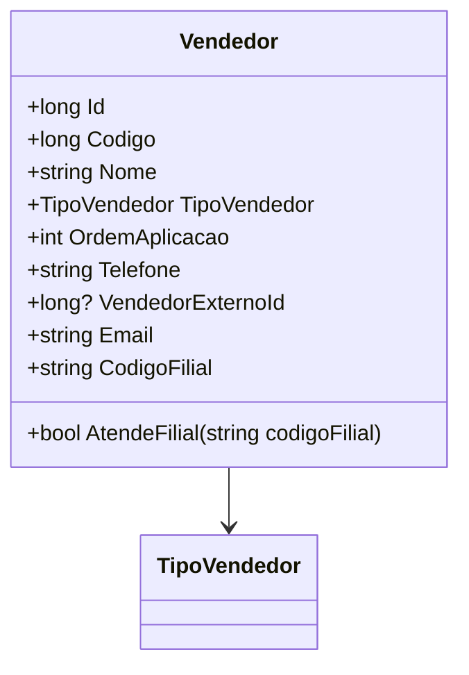

# Vendedor
**Namespace**: IsthmusWinthor.Dominio.POCO  
**Nome do Arquivo**: Vendedor.cs  

## Visão Geral e Responsabilidade
A classe `Vendedor` atua como uma representação do vendedor no sistema, armazenando informações essenciais que são críticas para o processo de venda. Seu papel é garantir que sejam inicializadas propriedades relevantes, além de fornecer mecanismos para validação de condições como o atendimento a filiais específicas. A classe resolve o problema de negócio de identificar e gerenciar a relação e o contexto do vendedor em transações comerciais, facilitando a aplicação de regras de negócio associadas.

## Métodos de Negócio

### AtendeFilial: Público
- **Objetivo**: Garante que o vendedor possa ser associado a uma filial específica e que aplicabilidades sejam cohentes com a lógica de negócios.
- **Comportamento**: 
  1. O método recebe um `codigoFilial` como parâmetro.
  2. Ele verifica se o `CodigoFilial` do vendedor é igual ao código de filial geral (`CODIGO_FILIAL_GERAL`).
  3. Se for igual, retorna `true`, permitindo que o vendedor atenda a qualquer filial.
  4. Caso contrário, compara `CodigoFilial` com o `codigoFilial` informado, retornando `true` se forem iguais ou `false` se não forem.
  
- **Retorno**: Retorna um valor booleano que indica se o vendedor pode atender a filial informada.

## Propriedades Calculadas e de Validação

### CodigoFilial
- A propriedade `CodigoFilial` tem uma lógica de validação no `set` que atribui um valor padrão de `CODIGO_FILIAL_GERAL` caso o valor fornecido seja nulo ou vazio. Isso permite que a aplicação sempre tenha um código de filial válido para os vendedores.

## Navigations Property
- Não existem propriedades que sejam classes complexas do domínio nesta classe.

## Tipos Auxiliares e Dependências
- **Enumeradores**:
  - `[TipoVendedor](TipoVendedor.md)`

## Diagrama de Relacionamentos

