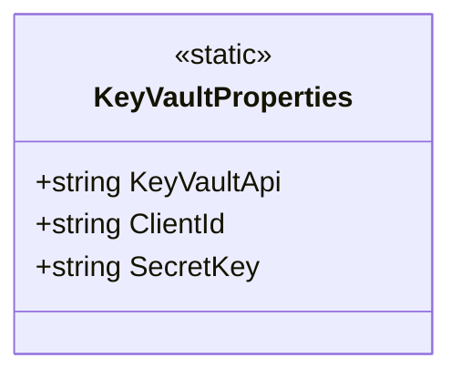

# KeyVaultProperties
**Namespace**: IsthmusWinthor.Dominio.PropertiesConfig  
**Nome do Arquivo**: KeyVaultProperties.cs  

### Visão Geral e Responsabilidade
A classe `KeyVaultProperties` é uma classe estática que encapsula as propriedades de configuração necessárias para acessar um Azure Key Vault. Ela fornece valores essenciais, como a URL do Key Vault, o ID do cliente e a chave secreta. Isso permite que as aplicações acessem de forma centralizada e segura os segredos armazenados, garantindo que a configuração sensível não esteja diretamente codificada em outras partes do sistema. A classe, portanto, desempenha um papel crucial na segurança do gerenciamento de segredos da aplicação.

### Métodos de Negócio
Não há métodos de negócio nesta classe, uma vez que ela é puramente uma coleção de propriedades de configuração.

### Propriedades Calculadas e de Validação
As seguintes propriedades são oferecidas sem lógica, mas servem a função informativa relativa às credenciais de acesso:

- `KeyVaultApi`: Retorna a URL do Azure Key Vault para acesso programático.
- `ClientId`: Retorna o ID do cliente utilizado para autenticação no Azure.
- `SecretKey`: Retorna a chave secreta necessária para acessos seguros ao Key Vault.

#### Observação
Embora estas propriedades não contenham lógica de cálculo, sua validação ocorre no nível da implementação, onde os valores precisam corresponder às credenciais válidas no ambiente do Azure.

### Navigations Property
A classe não possui navigations properties que se conectem a outras classes do domínio.

### Tipos Auxiliares e Dependências
Esta classe não utiliza enumeradores ou classes estáticas/helpers externas além de seus próprios valores de string.

### Diagrama de Relacionamentos

Este diagrama ilustra a estrutura da classe `KeyVaultProperties`, representando suas propriedades estáticas disponíveis, mas não fornece relacionamentos complexos, uma vez que se trata de uma configuração isolada.
