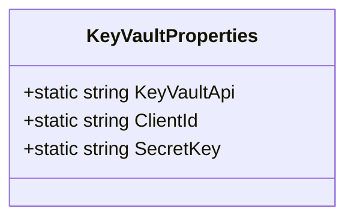

# KeyVaultProperties
**Namespace**: IsthmusWinthor.Dominio.PropertiesConfig  
**Nome do Arquivo**: KeyVaultProperties.cs  

## Visão Geral e Responsabilidade
A classe `KeyVaultProperties` é um utilitário de configuração que centraliza as propriedades essenciais para a conexão e autenticação com o Azure Key Vault. O objetivo principal é facilitar a recuperação de segredos armazenados, como a chave secreta e a identificação do cliente, assegurando que esses valores estejam acessíveis de maneira centralizada e segura para outros componentes do sistema que necessitam acessar o Key Vault.

## Métodos de Negócio
- **Título**: `KeyVaultApi` (static)
  - **Objetivo**: Garante que a URL de acesso ao Azure Key Vault esteja sempre disponível e adequada para qualquer interação com o serviço.
  - **Comportamento**: Retorna a URL pré-definida que aponta para o Key Vault.
  - **Retorno**: Uma string representando a URL do Key Vault.

- **Título**: `ClientId` (static)
  - **Objetivo**: Fornece a identificação do cliente necessário para a autenticação ao Azure Key Vault.
  - **Comportamento**: Retorna o ClientId configurado, essencial para autenticação.
  - **Retorno**: Uma string contendo o ClientId do aplicativo.

- **Título**: `SecretKey` (static)
  - **Objetivo**: Garante que a chave secreta necessária para autenticação também esteja acessível de forma centralizada.
  - **Comportamento**: Retorna o SecretKey utilizado para autenticação com o Key Vault.
  - **Retorno**: Uma string que representa a chave secreta.

## Propriedades Calculadas e de Validação
- Não existem propriedades calculadas ou de validação, dado que todas as propriedades da classe são estáticas e retornam valores constantes.

## Navigations Property
- Não há propriedades de navegação, pois a classe é estática e não possui instâncias de classes complexas do domínio.

## Tipos Auxiliares e Dependências
- Não existem enumeradores ou classes auxiliares utilizadas na classe `KeyVaultProperties`.

## Diagrama de Relacionamentos

---
Gerada em 29/12/2025 22:02:38
