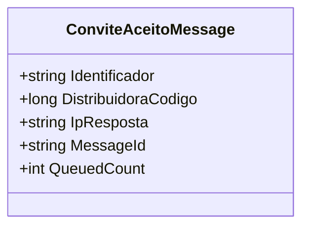

# ConviteAceitoMessage

**Namespace**: IsthmusWinthor.Dominio.QueueMessages  
**Nome do Arquivo**: ConviteAceitoMessage.cs  

## Visão Geral e Responsabilidade
A classe `ConviteAceitoMessage` representa uma mensagem que é enviada quando um convite é aceito no sistema. Sua principal responsabilidade é garantir que os dados necessários para processar um convite aceito sejam válidos e estejam completos, atuando como uma simples estrutura de transporte de dados (DTO). O problema de negócio que essa classe resolve é assegurar que as informações cruciais do convite (identificador, código da distribuidora e IP da resposta) sejam corretamente formatadas e validadas antes de serem processadas, evitando a introdução de dados inválidos no fluxo de comunicação.

## Métodos de Negócio
- **Título**: `ConviteAceitoMessage(string identificador, long distribuidoraCodigo, string ipResposta)` - `public`
  - **Objetivo**: Garantir que os parâmetros fornecidos para a criação de uma instância da mensagem do convite aceito sejam válidos.
  - **Comportamento**: 
    1. Recebe os parâmetros `identificador`, `distribuidoraCodigo` e `ipResposta`.
    2. Valida se `identificador` não é nulo ou vazio. Se inválido, lança uma `ArgumentException`.
    3. Valida se `distribuidoraCodigo` é maior que zero. Se inválido, lança uma `ArgumentException`.
    4. Valida se `ipResposta` não é nulo ou vazio. Se inválido, lança uma `ArgumentException`.
    5. Se todos os parâmetros forem válidos, inicializa as propriedades da classe com os valores correspondentes.
  - **Retorno**: Não retorna valor, mas resulta na criação de uma instância de `ConviteAceitoMessage` com dados validados.

## Propriedades Calculadas e de Validação
- **Sem propriedades com lógica na leitura ou validações complexas.** Todas as propriedades possuem apenas um `getter` simples ou são inicializadas no construtor.

## Navigations Property
- **Sem propriedades que representam classes complexas do domínio.**

## Tipos Auxiliares e Dependências
- **Nenhum tipo auxiliar ou dependência externa identificada.**

## Diagrama de Relacionamentos

