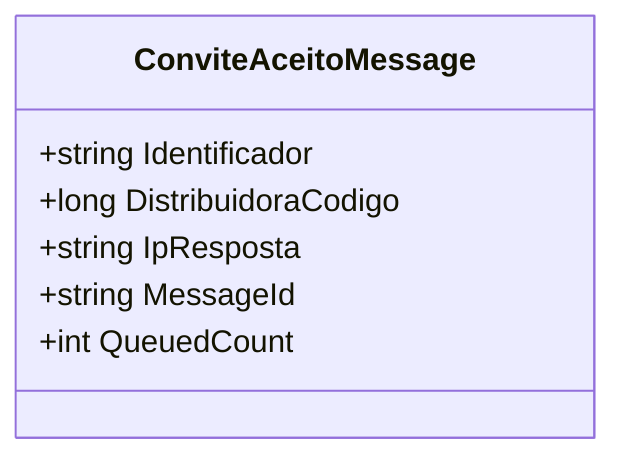

# ConviteAceitoMessage
- **Namespace**: IsthmusWinthor.Dominio.QueueMessages
- **Nome do Arquivo**: ConviteAceitoMessage.cs

## Visão Geral e Responsabilidade
A classe `ConviteAceitoMessage` representa uma mensagem de convite que foi aceita, atuando como um objeto de transporte de dados dentro do sistema. Sua responsabilidade principal é encapsular as informações necessárias que um convite aceito deve ter, como um identificador, código da distribuidora e o endereço IP da resposta. Isso é crítico para a integridade do fluxo de processamento das mensagens dentro do sistema de filas, garantindo que os dados se mantenham válidos e coerentes.

## Métodos de Negócio
### Construtor: `ConviteAceitoMessage(string identificador, long distribuidoraCodigo, string ipResposta)`
- **Objetivo**: Garante que as informações fundamentais do convite aceito sejam validas  na criação do objeto, evitando dados incorretos e mantendo a integridade do sistema.
- **Comportamento**:
  1. Verifica se o `identificador` é nulo ou vazio; se validado, lança uma exceção.
  2. Verifica se o `distribuidoraCodigo` é menor ou igual a zero; se validado, lança uma exceção.
  3. Verifica se o `ipResposta` é nulo ou vazio; se validado, lança uma exceção.
  4. Se todas as validações são satisfeitas, o objeto é criado com os valores fornecidos.
- **Retorno**: Não possui retorno, mas garante a criação correta do objeto.

## Propriedades Calculadas e de Validação
- Não existem propriedades com lógica de cálculo ou validação adicionais além daquelas implementadas no construtor.

## Navigation Property
- Não existem propriedades de navegação que referenciam outras classes do domínio.

## Tipos Auxiliares e Dependências
- Não existem Enums ou Classes Estáticas/Helpers utilizada dentro da classe `ConviteAceitoMessage`.

## Diagrama de Relacionamentos

---
Gerada em 29/12/2025 22:03:21
