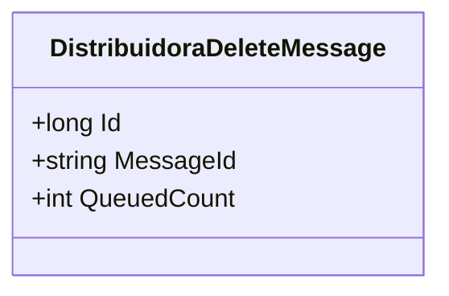

# DistribuidoraDeleteMessage
**Namespace**: IsthmusWinthor.Dominio.QueueMessages  
**Nome do Arquivo**: DistribuidoraDeleteMessage.cs  

## Visão Geral e Responsabilidade
A classe `DistribuidoraDeleteMessage` representa uma mensagem de fila que encapsula a informação necessária para deletar uma distribuidora no sistema. Sua principal responsabilidade é fornecer um formato estruturado para identificar as distribuidoras a serem removidas, garantindo que a operação de exclusão seja manipulada de maneira consistente e rastreável.

## Métodos de Negócio

### Título: MessageId e Visibilidade: Readonly
- **Objetivo**: Retornar a representação em string do ID da distribuidora.
- **Comportamento**: Esta é uma propriedade calculada que simplesmente converte o ID em uma string.
- **Retorno**: O valor retornado é o ID da distribuidora em formato de string, que pode ser utilizado para rastrear ou referenciar a mensagem.

### Título: QueuedCount e Visibilidade: Readonly
- **Objetivo**: Indicar a quantidade de vezes que a mensagem foi enfileirada.
- **Comportamento**: Esta propriedade retorna um valor fixo de 1, indicando que cada mensagem representa um único evento de exclusão de distribuidora.
- **Retorno**: O retorno será sempre 1, reforçando a semântica de que cada instância da mensagem reflete uma única operação.

## Propriedades Calculadas e de Validação
- `MessageId`: O `get` dessa propriedade calcula a string correspondente ao `Id`, representando a chave única da operação de exclusão.
- `QueuedCount`: O `get` dessa propriedade é fixo e sempre retornará 1, validando que a operação deve ser única.

## Navigations Property
Não há propriedades que são classes complexas do domínio nesta classe.

## Tipos Auxiliares e Dependências
- Não há enumeradores ou classes estáticas/helpers que esta classe utilize diretamente.

## Diagrama de Relacionamentos

---
Gerada em 29/12/2025 22:03:34
