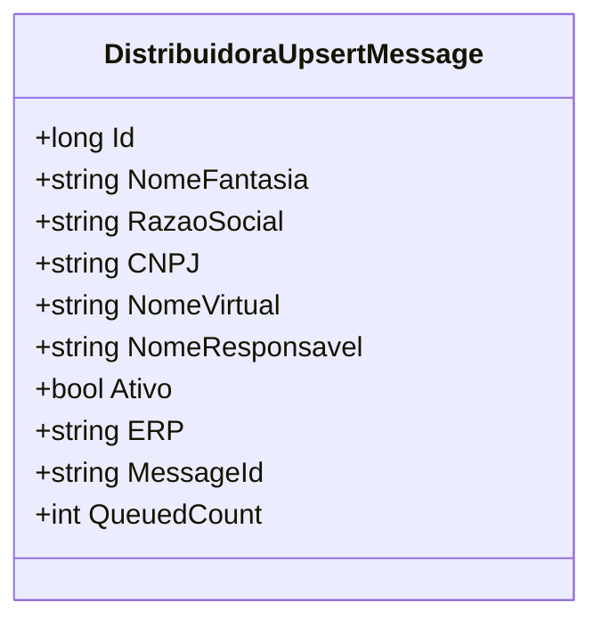

# DistribuidoraUpsertMessage
- **Namespace**: IsthmusWinthor.Dominio.QueueMessages
- **Nome do Arquivo**: DistribuidoraUpsertMessage.cs

Essa classe é uma representação de mensagem para transporte de dados relacionados à atualização de distribuidoras.

## Métodos de Negócio

### 1. Título: MessageId (Propriedade)
- **Objetivo**: Garante uma representação única da mensagem através do seu ID.
- **Comportamento**: Retorna a representação em string do ID da distribuidora. Isso é útil para rastreamento e identificação de mensagens em sistemas de fila.
- **Retorno**: Representação em string do `Id`.

### 2. Título: QueuedCount (Propriedade)
- **Objetivo**: Fornece a contagem de mensagens enfileiradas.
- **Comportamento**: Retorna o valor fixo de 1, indicando que essa mensagem representa uma única unidade de trabalho.
- **Retorno**: O número de vezes que essa mensagem deve ser processada (neste caso, sempre 1).

## Propriedades Calculadas e de Validação
Não existem propriedades com lógica no `get` ou validação no `set` nesta classe, uma vez que todas as propriedades são de somente leitura inicializadas por meio do construtor.

## Navigations Property
Não existem propriedades de navegação que sejam classes complexas do domínio nesta classe.

## Tipos Auxiliares e Dependências
- **Enums e Classes Estáticas/Helpers**: Não há referências a enumeradores ou classes auxiliares nesta classe.

## Diagrama de Relacionamentos

Esta documentação aborda o propósito e a lógica por trás da classe `DistribuidoraUpsertMessage`, descrevendo seus métodos e propriedades com foco na integridade de dados e regras de negócio que ela garante.
