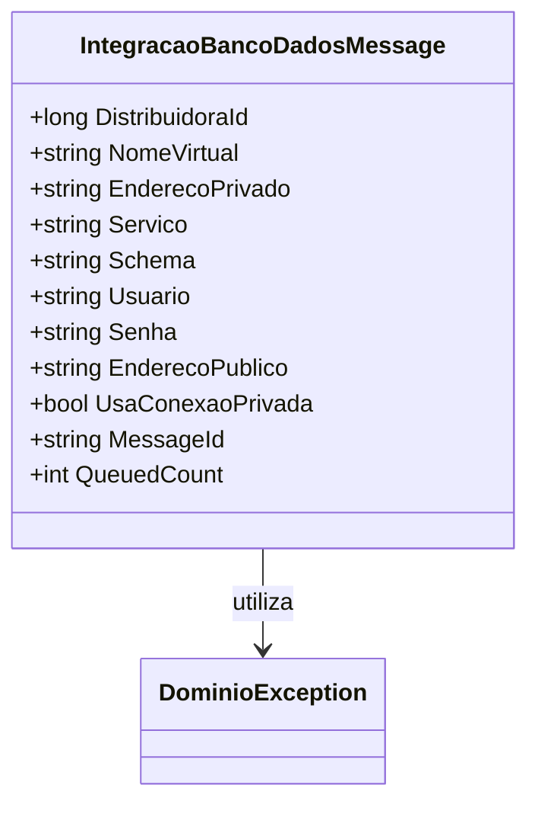

# IntegracaoBancoDadosMessage
**Namespace**: IsthmusWinthor.Dominio.QueueMessages  
**Nome do Arquivo**: IntegracaoBancoDadosMessage.cs

## Visão Geral e Responsabilidade
A classe `IntegracaoBancoDadosMessage` atua como um objeto de mensagem para a integração de dados entre sistemas, encapsulando as informações necessárias para estabelecer uma conexão de banco de dados. Sua principal responsabilidade é garantir a validade das informações críticas necessárias para a comunicação segura e eficaz com o banco de dados, atuando assim como um validador de dados de configuração de conexão.

## Métodos de Negócio

### Título: Construtor `IntegracaoBancoDadosMessage` (público)
- **Objetivo**: Garante que todos os dados obrigatórios para a integração do banco de dados sejam fornecidos e válidos na criação do objeto de mensagem.
- **Comportamento**: 
  1. Recebe parâmetros que representam as credenciais e a configuração do banco de dados.
  2. Chama um método de exceção que valida se nenhum parâmetro essencial é nulo ou inválido (ex.: `distribuidoraId` deve ser maior que zero, e as strings não podem estar vazias).
  3. Se as validações forem satisfeitas, os parâmetros são atribuídos às propriedades correspondentes.
- **Retorno**: O construtor não retorna nenhum valor; ele contribui para a criação de uma instância válida de `IntegracaoBancoDadosMessage`.

## Propriedades Calculadas e de Validação

### Propriedade: `MessageId`
- **Regra**: Retorna o `NomeVirtual` como identificador da mensagem, facilitando a identificação no sistema de filas.

### Propriedade: `QueuedCount`
- **Regra**: Define que o número de vezes que a mensagem foi enfileirada é constante e igual a 1, indicando que cada instância de mensagem representa uma única solicitação de integração.

## Navigation Properties

- Não há propriedades de navegação neste modelo.

## Tipos Auxiliares e Dependências
- **Classes**:
  - [DominioException](DominioException.md): Utilizada para gerenciamento de exceções de domínio durante a validação dos dados.
- **Enums**: Nenhum enumerador é utilizado nesta classe.

## Diagrama de Relacionamentos

Essa documentação técnica apresenta uma visão clara das responsabilidades e regras de negócio da classe `IntegracaoBancoDadosMessage`, ressaltando a importância da validação de dados para a integração com bancos de dados no contexto da aplicação em questão.
---
Gerada em 29/12/2025 22:03:57
