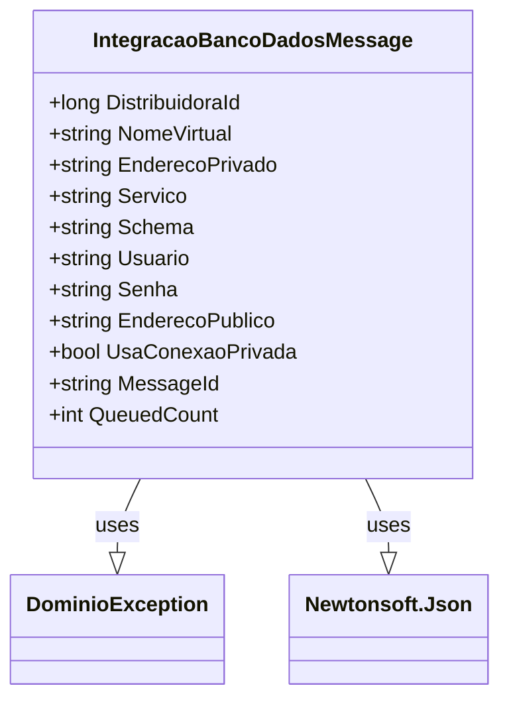

# IntegracaoBancoDadosMessage
**Namespace**: IsthmusWinthor.Dominio.QueueMessages  
**Nome do Arquivo**: IntegracaoBancoDadosMessage.cs  

## Visão Geral e Responsabilidade
A classe `IntegracaoBancoDadosMessage` representa uma mensagem de integração destinada a facilitar a comunicação e o compartilhamento de dados entre sistemas em um contexto de integração via banco de dados. Ela é responsável por assegurar que todas as informações necessárias para essa integração sejam fornecidas de forma adequada, garantindo assim a validade dos dados antes de serem processados. Este modelo atua como um contrato que necessita ser preenchido corretamente para evitar erros durante as operações de integração.

## Métodos de Negócio

### Método: `IntegracaoBancoDadosMessage`
- **Visibilidade**: Public
- **Objetivo**: Garantir que todos os dados essenciais para uma integração de banco de dados sejam fornecidos e válidos.
- **Comportamento**: O construtor da classe valida os parâmetros fornecidos. Se algum dos parâmetros obrigatórios estiver ausente ou inválido (por exemplo, um `DistribuidoraId` menor ou igual a zero ou uma string vazia para qualquer um dos outros parâmetros), uma exceção é lançada.
- **Retorno**: Este método não retorna um valor, mas garante que a instância da classe seja criada somente quando os dados forem válidos.

## Propriedades Calculadas e de Validação
- **MessageId**: Retorna o `NomeVirtual`, que é usado como identificador único da mensagem.
- **QueuedCount**: Retorna sempre o valor `1`, indicando que esta instância representa uma única mensagem na fila.

## Navigations Property
- (Não existem propriedades que representam classes complexas do domínio nesta classe.)

## Tipos Auxiliares e Dependências
- **Exceções**: `DominioException` - Classe utilizada para lançar erros específicos de domínio quando as regras de validação não são cumpridas.
- **Serialização**: `Newtonsoft.Json` - Biblioteca utilizada para manipulação de JSON, especialmente na construção do objeto através do atributo `[JsonConstructor]`.

## Diagrama de Relacionamentos

Esta documentação reflete a estrutura e as práticas que devem ser observadas ao trabalhar com a classe `IntegracaoBancoDadosMessage`, facilitando o entendimento e a manutenção do código por parte de outros desenvolvedores e partes interessadas no sistema.
