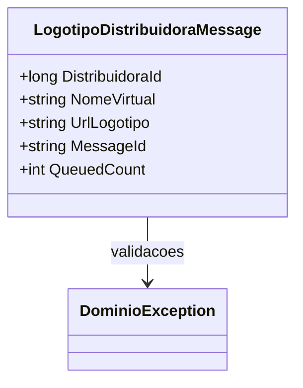

# LogotipoDistribuidoraMessage
**Namespace**: IsthmusWinthor.Dominio.QueueMessages  
**Nome do Arquivo**: LogotipoDistribuidoraMessage.cs  

## Visão Geral e Responsabilidade
A classe `LogotipoDistribuidoraMessage` representa uma mensagem que encapsula informações sobre o logotipo de uma distribuidora. Ela é utilizada para transmitir dados através de uma fila de mensagens, assegurando que somente informações válidas sejam criadas e manipuladas. Sua responsabilidade primária é garantir a integridade dos dados que compõem a mensagem, evitando a criação de objetos com valores inválidos.

## Métodos de Negócio

### Título: Construtor (visibilidade: pública)
- **Objetivo**: Garantir que os dados da mensagem sejam válidos no momento da criação do objeto, evitando inconsistências e erros na aplicação.
- **Comportamento**: O construtor recebe três parâmetros. Ele verifica se o `distribuidoraId` é maior que zero e se `nomeVirtual` e `urlLogotipo` não são nulos ou vazios. Caso alguma dessas condições não seja atendida, uma exceção é lançada através de `DominioException.ThrowWhen`.
- **Retorno**: Não retorna um valor. Se os dados não forem válidos, uma exceção é gerada, interrompendo a instância da classe.

## Propriedades Calculadas e de Validação
- **MessageId**: Retorna o `NomeVirtual`, que atua como um identificador único na fila. É uma concatenação utilizada para garantir que a mensagem tenha uma forma identificadora.
- **QueuedCount**: Retorna sempre o valor `1`, indicando que a mensagem é contada como uma única instância na fila.

## Navigations Property
Não existem propriedades que sejam classes complexas do domínio a serem listadas nesta classe.

## Tipos Auxiliares e Dependências
- **Exceção**: Dependência de `DominioException` para validação de dados.

## Diagrama de Relacionamentos

