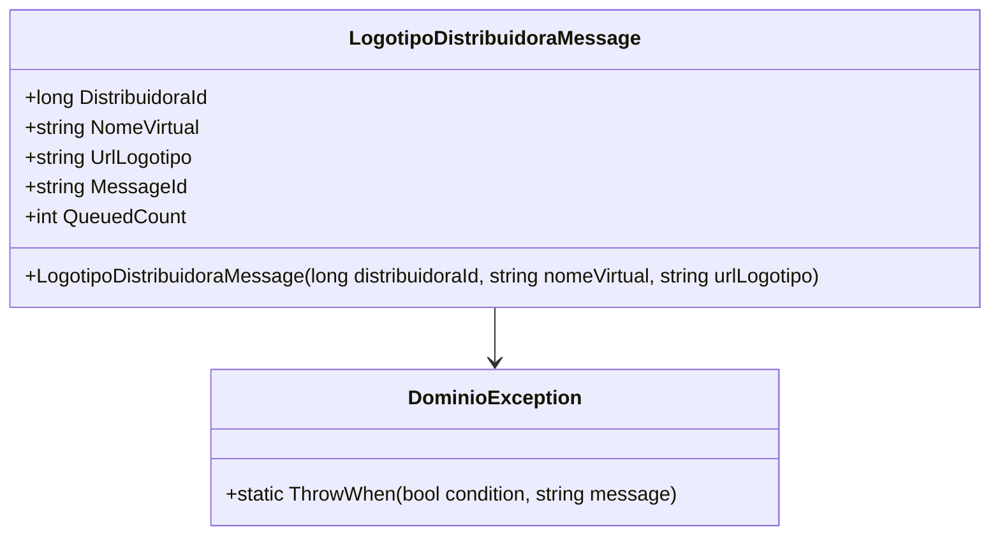

# LogotipoDistribuidoraMessage
- **Namespace**: IsthmusWinthor.Dominio.QueueMessages
- **Nome do Arquivo**: LogotipoDistribuidoraMessage.cs

## Visão Geral e Responsabilidade
A classe `LogotipoDistribuidoraMessage` é responsável por encapsular mensagens relacionadas ao logotipo de uma distribuidora em um sistema de fila. Ela garante que os dados essenciais do logotipo sejam transportados de forma segura, validando informações críticas como o ID da distribuidora, o nome virtual e a URL do logotipo. A ausência de dados válidos resulta em uma exceção, garantindo a integridade dos dados e evitando que informações inválidas sejam processadas.

## Métodos de Negócio

### Construtor: `LogotipoDistribuidoraMessage(long distribuidoraId, string nomeVirtual, string urlLogotipo)`
- **Objetivo**: Garante que as informações do logotipo da distribuidora sejam válidas antes de serem armazenadas.
- **Comportamento**:
  1. Chama `DominioException.ThrowWhen` para validar se o `distribuidoraId` é maior que zero e se `nomeVirtual` e `urlLogotipo` não são nulos ou vazios.
  2. Se qualquer uma das condições de validação falhar, uma exceção é lançada com a mensagem "Logotipo inválido!".
  3. Se as validações forem bem-sucedidas, as propriedades `DistribuidoraId`, `NomeVirtual` e `UrlLogotipo` são inicializadas com os valores fornecidos.
- **Retorno**: Não possui um retorno explícito, mas gerencia a criação do objeto com propriedades válidas, ou lança uma exceção no caso contrário.

## Propriedades Calculadas e de Validação

### Propriedades:
- `MessageId`: Retorna o `NomeVirtual`, que é usado como identificação da mensagem na fila.
  - **Regra**: O `MessageId` sempre deve refletir o nome virtual do logotipo, assegurando um vínculo claro entre a mensagem e a distribuidora.

- `QueuedCount`: Retorna um valor constante de 1, indicando que esta mensagem representa uma única instância de logotipo na fila.

## Navigations Property
Não há navigations properties que sejam classes complexas do domínio neste caso.

## Tipos Auxiliares e Dependências
- **Exceções**:
  - `DominioException`: Classe responsável por lançar exceções específicas do domínio quando as validações falham.

## Diagrama de Relacionamentos

---
Gerada em 29/12/2025 22:04:17
