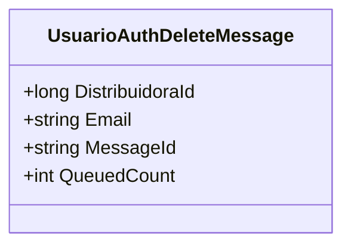

# UsuarioAuthDeleteMessage
**Namespace**: IsthmusWinthor.Dominio.QueueMessages  
**Nome do Arquivo**: UsuarioAuthDeleteMessage.cs  

## Visão Geral e Responsabilidade
A classe `UsuarioAuthDeleteMessage` é responsável por encapsular a mensagem de exclusão de autenticação de usuário em um sistema que utiliza filas para gerenciar eventos. Esta classe resolve o problema de comunicação entre distintos componentes do sistema, permitindo que a informação sobre a exclusão de um usuário seja enviada de forma consistente e estruturada.

## Métodos de Negócio

### Título: MessageId (ReadOnly)
- **Objetivo**: Garantir a unicidade da mensagem identificar um usuário pelo seu e-mail durante o processo de exclusão.
- **Comportamento**: O método retorna o valor do e-mail que é utilizado como identificador da mensagem. Isso assegura que cada mensagem relacionada à exclusão de usuário esteja vinculada de forma única ao seu respectivo e-mail.
- **Retorno**: Retorna uma string que representa o e-mail do usuário a ser excluído.

### Título: QueuedCount (ReadOnly)
- **Objetivo**: Estabelecer o número de vezes que a mensagem foi enfileirada, o que é essencial para rastrear tentativas de processamento.
- **Comportamento**: O método simplesmente retorna o valor fixo de 1, indicando que esta mensagem específica representa uma única tentativa de operação.
- **Retorno**: Retorna um inteiro com o valor 1, representando a contagem de mensagens enfileiradas.

## Propriedades Calculadas e de Validação
Não existem propriedades calculadas ou de validação nesta classe, pois todas as propriedades são somente leitura e seu valor é estabelecido através do construtor.

## Navigations Property
Não há propriedades que sejam classes complexas do domínio nesta classe.

## Tipos Auxiliares e Dependências
- Nenhum enumerador ou classe estática/helper é utilizado nesta classe.

## Diagrama de Relacionamentos

---
Gerada em 29/12/2025 22:04:28
