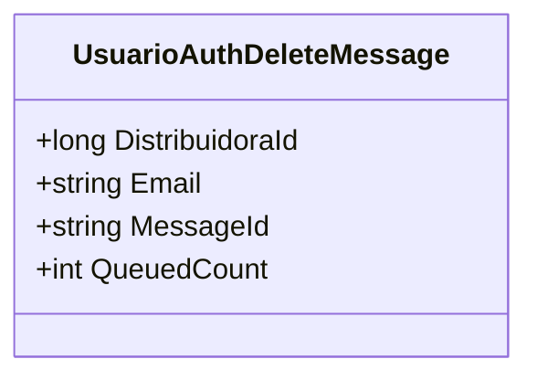

# UsuarioAuthDeleteMessage
**Namespace**: IsthmusWinthor.Dominio.QueueMessages  
**Nome do Arquivo**: UsuarioAuthDeleteMessage.cs  

## Visão Geral e Responsabilidade
A classe `UsuarioAuthDeleteMessage` representa uma mensagem de fila utilizada para a exclusão de autenticações de usuário. Seu papel é encapsular os dados necessários para notificar o sistema sobre a remoção de um usuário associado a uma distribuidora. Essa classe garante que as operações de exclusão sejam executadas corretamente no contexto de gerenciamento de autenticações de usuários.

## Métodos de Negócio

### Título: `MessageId` (Propriedade)
- **Objetivo**: Fornece um identificador único para a mensagem, que é baseado no e-mail do usuário a ser deletado.
- **Comportamento**: Retorna o valor do e-mail, garantindo que cada mensagem de exclusão possa ser referenciada de forma única.
- **Retorno**: O e-mail do usuário como uma string, que é utilizado como identificador na fila.

### Título: `QueuedCount` (Propriedade)
- **Objetivo**: Indica quantas vezes a mensagem foi enfileirada para processamento.
- **Comportamento**: O valor é sempre retornado como 1, indicando que esta instância da mensagem representa uma única operação de exclusão.
- **Retorno**: Um inteiro que representa o contar de enfileiramento, sempre fixo em 1.

## Propriedades Calculadas e de Validação
As propriedades `MessageId` e `QueuedCount` não contêm validações no `set`, uma vez que não são armazenados valores variáveis. 

## Navigations Property
Não há Navigations Properties complexas na classe `UsuarioAuthDeleteMessage`.

## Tipos Auxiliares e Dependências
- Nenhum Enumerador ou classe auxiliar está diretamente utilizado na implementação atual.

## Diagrama de Relacionamentos

