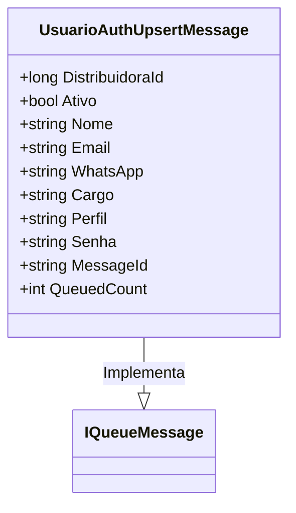

# UsuarioAuthUpsertMessage
**Namespace**: IsthmusWinthor.Dominio.QueueMessages  
**Nome do Arquivo**: UsuarioAuthUpsertMessage.cs  

## Visão Geral e Responsabilidade
A classe `UsuarioAuthUpsertMessage` é responsável por representar mensagens de atualização ou inserção de informações de autenticação de usuários. Ela é utilizada no contexto de filas de mensagens, permitindo que informações críticas sobre usuários, como a inclusão ou atualização de seus dados, sejam enviadas e processadas de forma assíncrona. Essa abordagem é fundamental para garantir a consistência das informações de autenticação em serviços distribuídos.

## Métodos de Negócio
### Título: MessageId (Propriedade – somente leitura)
- **Objetivo**: Garante que a identidade única da mensagem seja baseada no e-mail do usuário, facilitando a deduplicação de mensagens em um sistema de filantragem.
- **Comportamento**: Retorna o e-mail do usuário como um identificador único da mensagem. Essa implementação assegura que cada mensagem enviada contenha uma referência clara ao usuário associado.
- **Retorno**: O valor retornado é uma string representando o e-mail do usuário, que serve como um identificador único da mensagem.

### Título: QueuedCount (Propriedade – somente leitura)
- **Objetivo**: Define o número de vezes que a mensagem foi enfileirada, neste caso fixo em 1, indicando que cada instância da mensagem é destinada à fila exatamente uma vez.
- **Comportamento**: Sempre retorna 1, sugerindo que a mensagem é idealmente enfileirada uma única vez por operação de autenticação.
- **Retorno**: O valor retornado é um inteiro constante, que representa a frequência de enfileiramento da mensagem.

## Propriedades Calculadas e de Validação
Não há propriedades com lógica de cálculo ou validação específicas além das propriedades que servem como identificadores simples e constantes.

## Navigation Property
- Não há propriedades que representem classes complexas do domínio nesta classe.

## Tipos Auxiliares e Dependências
- Dependências:
  - [JsonConstructor](https://www.newtonsoft.com/json) - Um atributo da biblioteca Newtonsoft.Json que facilita a desserialização de JSON.

## Diagrama de Relacionamentos

Esta documentação visa fornecer uma visão clara e concisa das responsabilidades e regras de negócio associadas à classe `UsuarioAuthUpsertMessage`, estruturando as informações de maneira que facilite o entendimento e a manutenção do sistema.
---
Gerada em 29/12/2025 22:04:46
