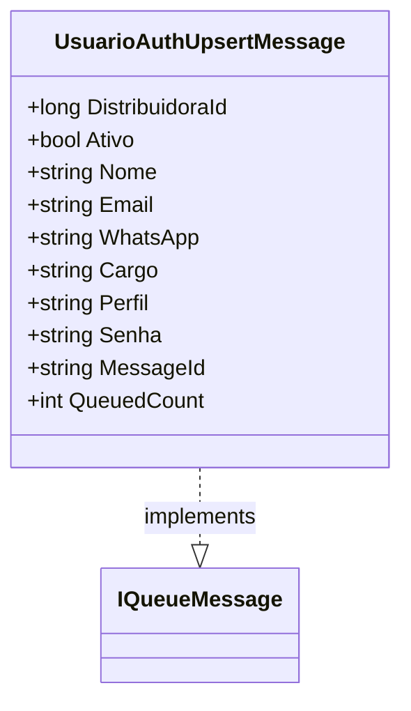

# UsuarioAuthUpsertMessage

**Namespace**: IsthmusWinthor.Dominio.QueueMessages  
**Nome do Arquivo**: UsuarioAuthUpsertMessage.cs

## Visão Geral e Responsabilidade
A classe `UsuarioAuthUpsertMessage` é um modelo de domínio que serve como um objeto de transporte de dados para operações de upsert (inserção ou atualização) relacionadas à autenticação de usuários. Esta classe encapsula informações essenciais sobre um usuário na arquitetura de mensagens, garantindo que os dados necessários para realizar a autenticação e autorização sejam transmitidos de forma consistente entre os componentes do sistema.

## Métodos de Negócio
### Título: MessageId (Propriedade de Leitura)
- **Objetivo**: Garante que cada mensagem tenha um identificador único baseado no e-mail do usuário.
- **Comportamento**: Retorna o e-mail do usuário como identificador, assegurando que não haja duplicidade nas filas de mensagens enviadas.
- **Retorno**: O valor retornado é o e-mail do usuário (`string`), que pode ser usado como um identificador único na fila.

### Título: QueuedCount (Propriedade de Leitura)
- **Objetivo**: Determina a contagem de vezes que a mensagem foi enfileirada.
- **Comportamento**: Retorna um valor fixo de 1, indicando que esta mensagem deve ser enfileirada uma única vez.
- **Retorno**: O valor retornado é um inteiro (`int`), representando a contagem de mensagens enfileiradas, que neste caso, é sempre 1.

## Propriedades Calculadas e de Validação
- **MessageId**: Esta propriedade utiliza o e-mail como um identificador único. A regra é que cada e-mail deve ser exclusivo dentro do sistema para garantir a unicidade das mensagens.
  
- **QueuedCount**: A propriedade `QueuedCount` tem um valor fixo, o que denota que deve apenas ser enfileirada uma vez. Sua regra é manter a integridade da mensagem dentro do fluxo de filas, evitando duplicidades desnecessárias.

## Navigations Property
Não há propriedades de navegação que são classes complexas do domínio nesta classe.

## Tipos Auxiliares e Dependências
- **IQueueMessage**: Interface que esta classe implementa, define como a mensagem deve se comportar em um contexto de fila.
- **Newtonsoft.Json**: Biblioteca utilizada para a serialização/deserialização de JSON, fundamental para o transporte de dados.

## Diagrama de Relacionamentos

Esta documentação fornece uma visão clara sobre as regras de negócio e a lógica envolvida na classe `UsuarioAuthUpsertMessage`, ajudando a manter a integridade dos dados e eficiência nas operações de autenticação dentro do sistema corporativo.
