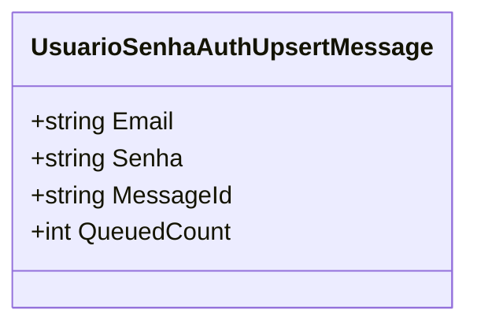

# UsuarioSenhaAuthUpsertMessage
- **Namespace**: IsthmusWinthor.Dominio.QueueMessages
- **Nome do Arquivo**: UsuarioSenhaAuthUpsertMessage.cs

> Classe responsável por transportar informações de autenticação de usuários, especificamente o email e a senha, em mensagens de fila.

## Métodos de Negócio

### Título: `MessageId` (Propriedade)
- **Objetivo**: Garante a unicidade da mensagem de autenticação na fila com base no email do usuário.
- **Comportamento**: Retorna o valor do email como identificador da mensagem, assegurando que cada mensagem possa ser facilmente identificada e relacionada a um usuário.
- **Retorno**: Retorna uma string que representa o `MessageId`, que é o email do usuário.

### Título: `QueuedCount` (Propriedade)
- **Objetivo**: Indica o número de vezes que a mensagem foi enfileirada.
- **Comportamento**: Sempre retorna o valor fixo de `1`, representando que essa mensagem entrou na fila uma única vez.
- **Retorno**: Retorna um inteiro que representa o número de vezes que a mensagem foi enfileirada.

## Propriedades Calculadas e de Validação
- **MessageId**:
  - Regra: A propriedade `MessageId` é calculada a partir do `Email`, assegurando que cada mensagem seja única e possa ser rastreada de volta ao usuário correspondente.
  
- **QueuedCount**:
  - Regra: A propriedade `QueuedCount` é uma constante e representa que a mensagem foi encaminhada para a fila uma única vez.

## Navigations Property
- Nenhuma propriedade de navegação complexa é presente nesta classe.

## Tipos Auxiliares e Dependências
- Nenhum enumerador ou classe estática/helper é utilizado nesta classe.

## Diagrama de Relacionamentos

