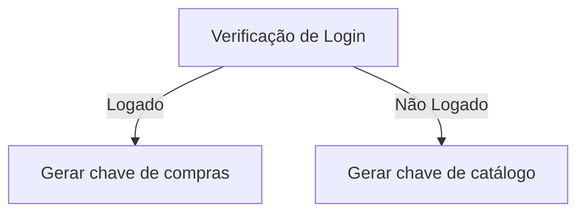
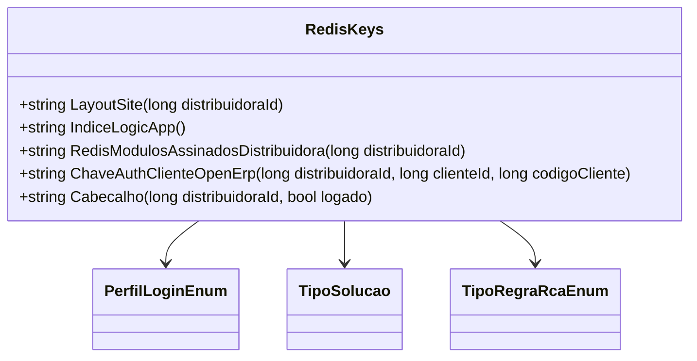

# RedisKeys

**Namespace**: IsthmusWinthor.Dominio  
**Nome do Arquivo**: RedisKeys.cs  

## Visão Geral e Responsabilidade
A classe `RedisKeys` é um utilitário que gera chaves para acesso a dados armazenados no Redis, permitindo que outros componentes do sistema recuperem informações específicas de acordo com as regras de negócio. Seu papel é estabelecer um padrão de nomenclatura e organização para as chaves, facilitando a integridade dos dados e a implementação de funcionalidades que dependem do armazenamento em cache.

## Métodos de Negócio

### 1. Título: LayoutSite (public)
- **Objetivo**: Gera a chave para o layout do site de uma distribuidora específica.
- **Comportamento**: Constrói uma string formatada com o `distribuidoraId`, utilizando a nomenclatura padrão para o layout do site.
- **Retorno**: Retorna a chave representando o layout da distribuidora em forma de string.

### 2. Título: IndiceLogicApp (public)
- **Objetivo**: Gera a chave padrão para identificação de configurações ou ações relacionadas ao aplicativo lógico.
- **Comportamento**: Retorna uma string fixa que serve como referência para as operações do aplicativo lógico.
- **Retorno**: Retorna a chave "indicelogicapp".

### 3. Título: RedisModulosAssinadosDistribuidora (public)
- **Objetivo**: Cria a chave que identifica os módulos assinados por uma distribuidora.
- **Comportamento**: Formata a string incluindo o `distribuidoraId`, que permite recuperar a informação de quais módulos estão ativos para a distribuidora.
- **Retorno**: Retorna a chave dos módulos assinados da distribuidora.

### 4. Título: ChaveAuthClienteOpenErp (public)
- **Objetivo**: Cria uma chave para autenticação de clientes em um sistema Open Erp.
- **Comportamento**: Constrói a chave utilizando o `distribuidoraId`, `clienteId` e `codigoCliente`, assegurando que cada cliente tenha uma chave única baseada nos seus identificadores.
- **Retorno**: Retorna a chave de autenticação específica do cliente no contexto Open Erp.

### 5. Título: Cabecalho (public)
- **Objetivo**: Gera a chave para o cabeçalho do cliente dependendo do seu estado de login.
- **Comportamento**: Utiliza o `distribuidoraId` e o estado de login do cliente para formatar a chave. Se o cliente estiver logado, gera uma chave de compras, caso contrário, gera uma chave de catálogo.
- **Retorno**: Retorna a chave do cabeçalho, relativa ao estado de autenticação do cliente.

## Propriedades Calculadas e de Validação
N/A

## Navigations Property
N/A

## Tipos Auxiliares e Dependências
- **Enumeradores**
  - [PerfilLoginEnum](PerfilLoginEnum.md)
  - [TipoSolucao](TipoSolucao.md)
  - [TipoRegraRcaEnum](TipoRegraRcaEnum.md)

## Diagrama de Relacionamentos

---
Gerada em 29/12/2025 20:06:15
