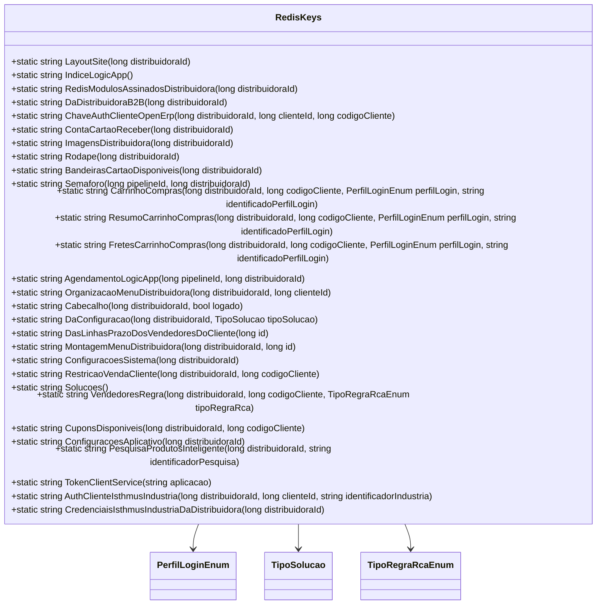

# RedisKeys

- **Namespace**: IsthmusWinthor.Dominio
- **Nome do Arquivo**: RedisKeys.cs

1. Visão Geral e Responsabilidade
   - A classe `RedisKeys` é um utilitário estático que fornece métodos para gerar chaves específicas de Redis para armazenamentos e acessos dinâmicos. Ela resolve problemas de nomenclatura e organização das chaves utilizadas nos serviços de cache Redis, proporcionando uma maneira padronizada e consistente de geração dessas chaves para diferentes entidades e cenários no contexto empresarial.

2. Métodos de Negócio

   _Não aplicável para métodos em classes utilitárias estáticas como esta. Todos os métodos fornecem strings formatadas sem lógica condicional complexa._

3. Propriedades Calculadas e de Validação

   - _Não aplicável. A classe não possui getters/setters calculados; apenas métodos estáticos para cálculo de chaves._

4. Navigations Property

   - _Não há propriedades de navegação, a classe não faz referência a objetos complexos do domínio._

5. Tipos Auxiliares e Dependências
   - Esta classe utiliza os seguintes enumeradores:
     - `[Enumeradores.PerfilLoginEnum](PerfilLoginEnum.md)`
     - `[Enumeradores.TipoSolucao](TipoSolucao.md)`
     - `[TipoRegraRcaEnum](TipoRegraRcaEnum.md)`

6. Diagrama de Relacionamentos

