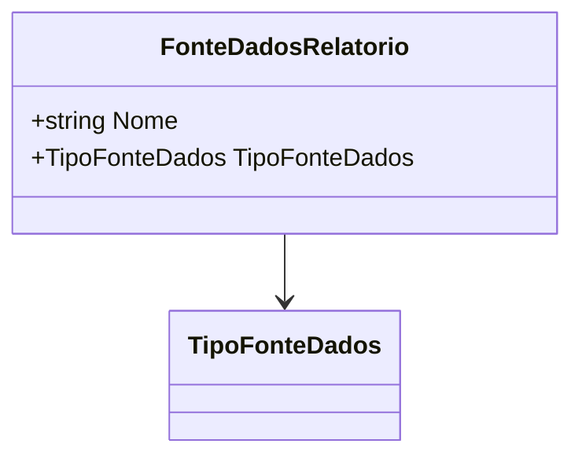

# FonteDadosRelatorio
**Namespace**: IsthmusWinthor.Dominio.Relatorios.Crud  
**Nome do Arquivo**: FonteDadosRelatorio.cs  

A classe `FonteDadosRelatorio` é responsável por representar as diferentes fontes de dados utilizadas em relatórios, permitindo categorizar essas fontes de acordo com seu tipo. Através desta classe, é possível garantir que os dados sejam coletados e manipulados de maneira que estejam sempre alinhados com sua definição correta.

## Métodos de Negócio
Nesta classe, não há métodos com lógica de negócio implementada. Apenas possui propriedades anêmicas.

## Propriedades Calculadas e de Validação
As propriedades `Nome` e `TipoFonteDados` não contêm lógica de cálculo ou validação adicionais.

## Navigations Property
A classe contém uma propriedade complexa:
- `TipoFonteDados`: Representa um enumerador que categoriza o tipo da fonte de dados.
  - Link associado: `[TipoFonteDados](TipoFonteDados.md)`

## Tipos Auxiliares e Dependências
A classe depende do enumerador:
- `TipoFonteDados`: 
  - Link associado: `[TipoFonteDados](TipoFonteDados.md)`

## Diagrama de Relacionamentos

