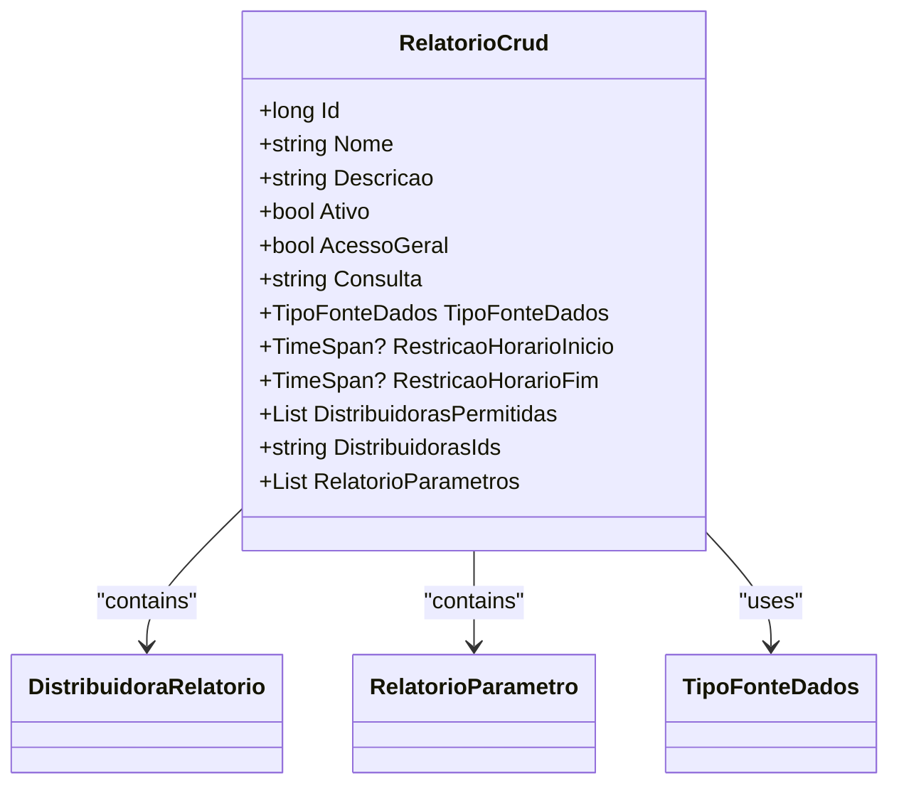

# RelatorioCrud
**Namespace**: IsthmusWinthor.Dominio.Relatorios.Crud  
**Nome do Arquivo**: RelatorioCrud.cs  

## Visão Geral e Responsabilidade
A classe `RelatorioCrud` representa um modelo de relatório no contexto da aplicação, encapsulando as propriedades necessárias para gerenciar e delinear um relatório dentro do sistema. O principal propósito desse modelo é permitir a definição de metadados sobre relatórios, facilitando a recuperação e apresentação de dados relevantes de acordo com as permissões de acesso e restrições definidas. Isso resolve o problema de gerenciamento de informações relativas a relatórios de forma estruturada e acessível.

## Propriedades Calculadas e de Validação
- **Nome**: Deve ser preenchido para garantir que cada relatório tenha um nome identificável.
- **Descricao**: Propriedade obrigatória que serve para descrever o relatório, assegurando que os usuários compreendam seu conteúdo.
- **Consulta**: Necessária para a execução correta do relatório, assegurando que os dados a serem recuperados estejam bem definidos.
- **TipoFonteDados**: Define a origem dos dados, impactando a maneira como os dados são consultados e integrados.
- **RestricaoHorarioInicio** e **RestricaoHorarioFim**: Opcionalmente definem janelas de horário em que o relatório pode ser acessado, introduzindo uma camada de segurança em relação ao acesso aos dados.
- **DistribuidorasIds**: Utilizado para armazenar identificadores de distribuidoras, que podem ser usadas na filtragem dos dados apresentados, ajudando na validação de acesso.

## Navigations Property
- **DistribuidorasPermitidas**: 
  - Link: [DistribuidoraRelatorio](DistribuidoraRelatorio.md)
- **RelatorioParametros**: 
  - Link: [RelatorioParametro](RelatorioParametro.md)

## Tipos Auxiliares e Dependências
- **Enumeradores**:
  - [TipoFonteDados](TipoFonteDados.md)

## Diagrama de Relacionamentos

---
Gerada em 29/12/2025 22:05:14
