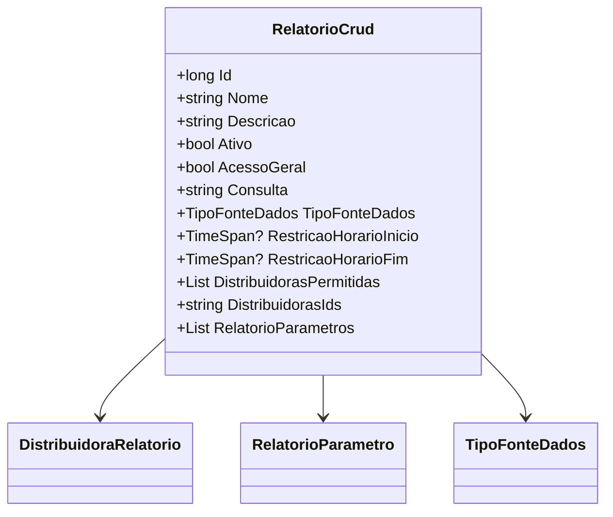

# RelatorioCrud
- **Namespace**: IsthmusWinthor.Dominio.Relatorios.Crud
- **Nome do Arquivo**: RelatorioCrud.cs

## Visão Geral e Responsabilidade
A classe `RelatorioCrud` representa um modelo no domínio para a criação e manipulação de relatórios dentro do sistema. Ela encapsula todos os dados necessários para descrever um relatório, incluindo seu nome, descrição, status de ativação, e configurações específicas, como a consulta de dados e as distribuidoras permitidas. Esse modelo garante que os dados utilizados para criar e executar relatórios estejam completos e válidos de acordo com as regras de negócio estabelecidas.

## Métodos de Negócio
Não existem métodos com lógica complexa na classe `RelatorioCrud`. Portanto, não há métodos a serem documentados nesta seção.

## Propriedades Calculadas e de Validação
- **Nome**: Propriedade que deve ser preenchida obrigatoriamente. Garante que um nome válido seja fornecido ao salvar um relatório.
- **Descricao**: Propriedade que deve ser preenchida obrigatoriamente. Garante que uma descrição do relatório esteja presente.
- **Consulta**: Propriedade que deve ser preenchida obrigatoriamente. Garante que a consulta SQL ou de outra natureza está obrigatoriamente definida para o relatório.
  
As restrições de horário `RestricaoHorarioInicio` e `RestricaoHorarioFim` podem ser usadas para validar se a execução do relatório está dentro de uma janela de horário válida.

## Navigations Property
- `[DistribuidoraRelatorio](DistribuidoraRelatorio.md)`: Classe que representa as distribuidoras que têm permissão para acessar o relatório.
- `[RelatorioParametro](RelatorioParametro.md)`: Classe que contém os parâmetros adicionais que podem ser configurados para cada relatório.

## Tipos Auxiliares e Dependências
- `[TipoFonteDados](TipoFonteDados.md)`: Enum que define os diferentes tipos de fontes de dados que podem ser utilizados pelo relatório.
  
## Diagrama de Relacionamentos

Neste diagrama, a classe `RelatorioCrud` está associada às classes `DistribuidoraRelatorio` e `RelatorioParametro`, enquanto a propriedade `TipoFonteDados` se refere a um enumerador que define os tipos de fontes de dados disponíveis.
