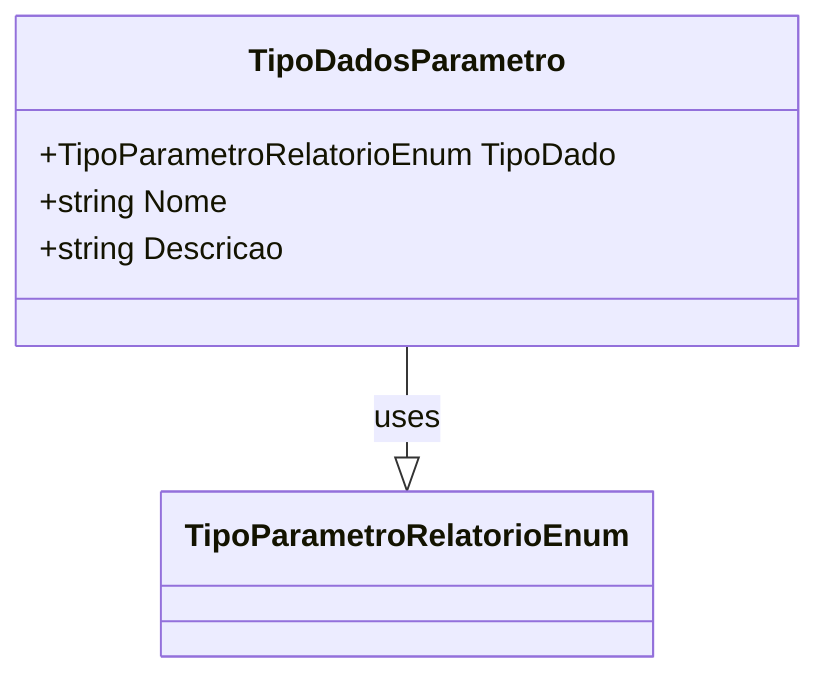

# TipoDadosParametro

**Namespace**: IsthmusWinthor.Dominio.Relatorios.Crud  
**Nome do Arquivo**: TipoDadosParametro.cs  

### Visão Geral e Responsabilidade
A classe `TipoDadosParametro` serve como um Data Transfer Object (DTO) para estruturar e transportar informações sobre os parâmetros de tipo de dados em relatórios. Sua principal função é estabelecer uma representação clara e tipada dos dados que podem ser utilizados na geração de relatórios, permitindo que a aplicação trabalhe de forma consistente com esses dados.

### Métodos de Negócio
Esta classe não contém métodos de negócio, sendo estritamente um modelo de dados (DTO) sem lógica complexa associada.

### Propriedades Calculadas e de Validação
Esta classe não contém propriedades com lógica em `get` ou validação em `set`.

### Navigation Property
Esta classe não possui propriedades que são classes complexas do domínio.

### Tipos Auxiliares e Dependências
- Enum: `[TipoParametroRelatorioEnum](TipoParametroRelatorioEnum.md)`

### Diagrama de Relacionamentos

