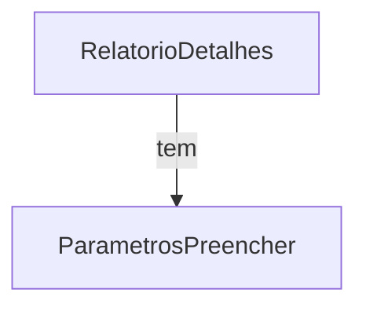
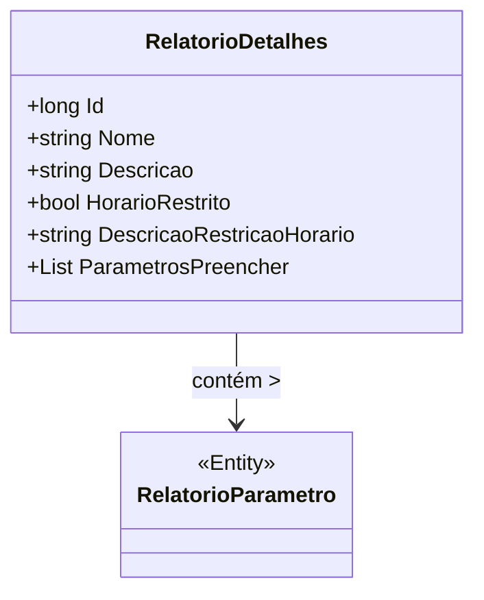

# RelatorioDetalhes

**Namespace**: IsthmusWinthor.Dominio.Relatorios.Execucao  
**Nome do Arquivo**: RelatorioDetalhes.cs

### Citação
A classe `RelatorioDetalhes` é um DTO (Data Transfer Object) que transporta informações sobre um relatório, incluindo seus detalhes e parâmetros a serem preenchidos.

### Visualização dos Flows

### Diagrama de Relacionamentos

### Tipos Auxiliares e Dependências
- `RelatorioParametro`: classe auxiliar que representa os parâmetros do relatório.
